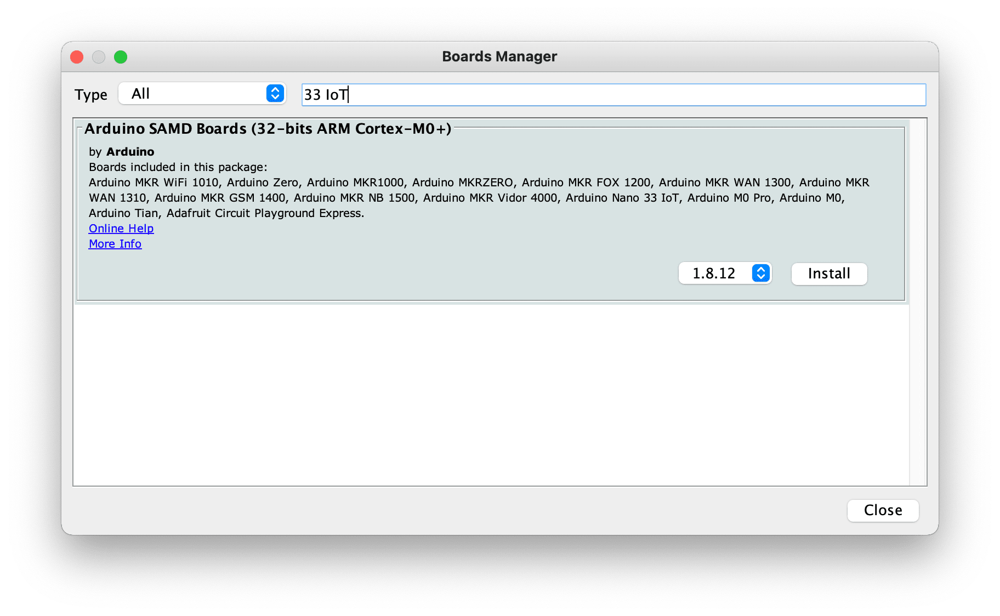
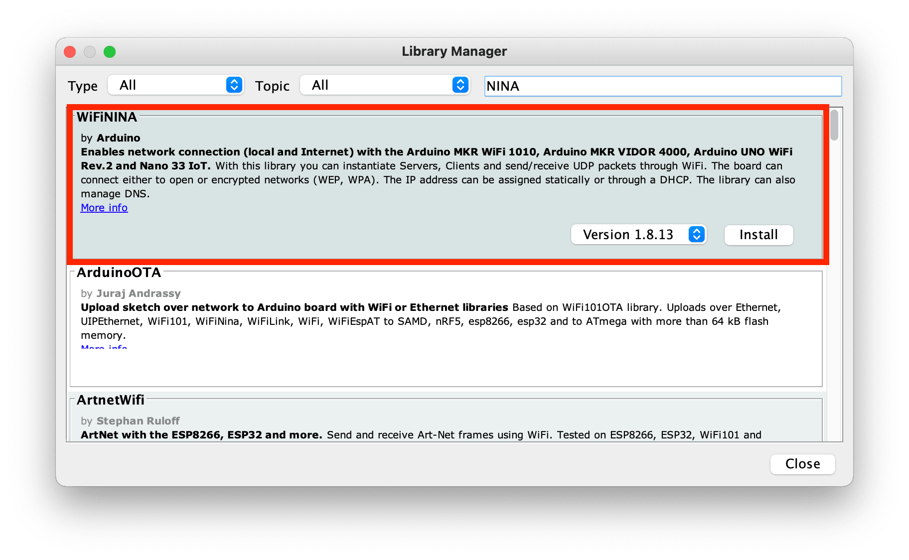
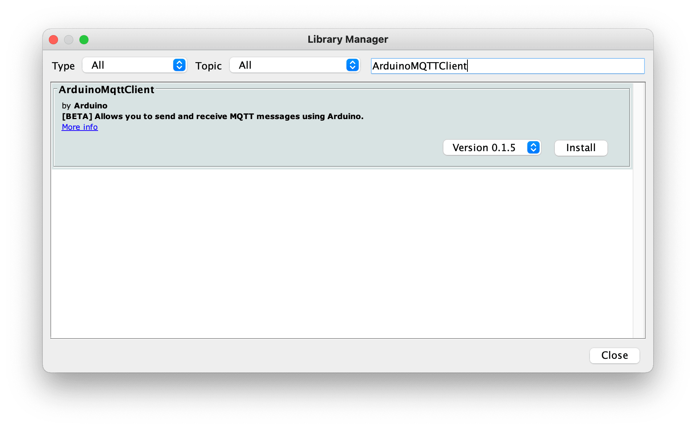

# Exercise 1 - Development Environment

Set up your computer for Arduino development.

## Arduino IDE
Install the Arduino IDE from https://arduino.cc/en/Main/Software#download

Click the "Just Download" button

Run the installer.

### Arduino SAMD Board Definitions
Use the Arduino Boards Manager to install the Arduino SAMD Board definitions. Open the Boards Manager using the menu _Tools -> Boards -> Boards Manager_

Search for "33 IoT" and install the Arduino SAMD Boards (32-bit ARM Cortex-M0+) definitions.

        
### Arduino Libraries        
Install the following Arduino Libraries using the Library manager. 

* WiFiNINA library (search for "NINA")
* Arduino MQTT Client library (search for "ArduinoMQTTClient")
* Arduino HTTP Client library (search for "ArduinoHTTPClient")
* Arduino BearSSL library (search for "ArduinoBearSSL")
* Adafruit DHT-22 library (search for "DHT22")

Open the library manager using the menu _Tools -> Manage Libraries_

Search for "NINA" and install the WiFiNINA library.

Search for "ArduinoMQTTClient" and install the Arduino MQTT Client library.

Search for "ArduinoHTTPClient" and install the Arduino HTTP Client library.

Search for "ArduinoBearSSL" and install the ArduinoBearSSL library. If you are prompted to install missing dependencies, choose "Install All".

Search for "DHT22" and install the Adafruit DHT sensor library. If you are prompted to install missing dependencies, choose "Install All".

Next [Exercise 2: Assemble the Hardware](exercise2.md)