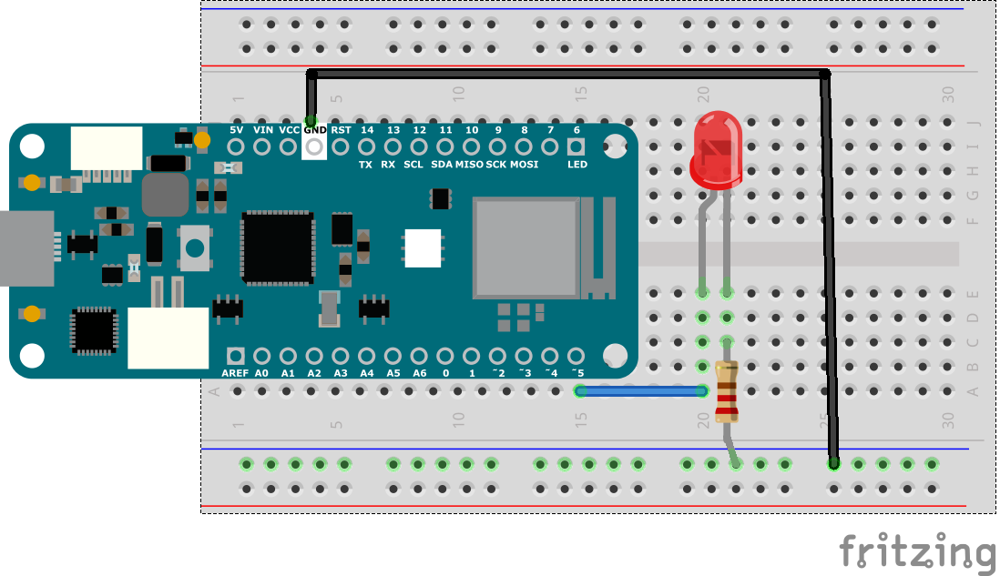
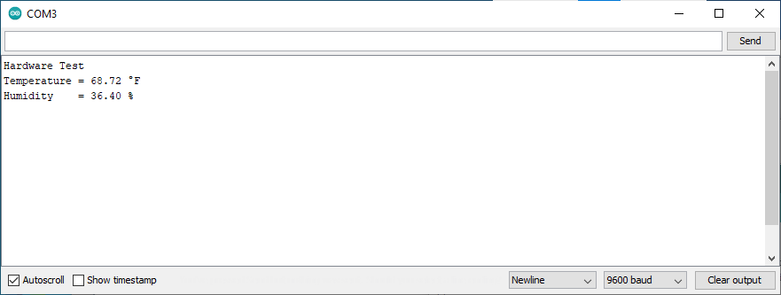
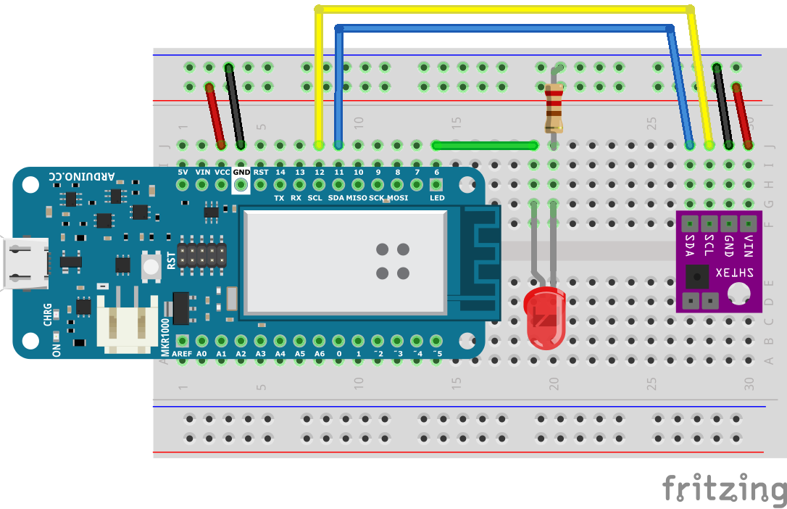
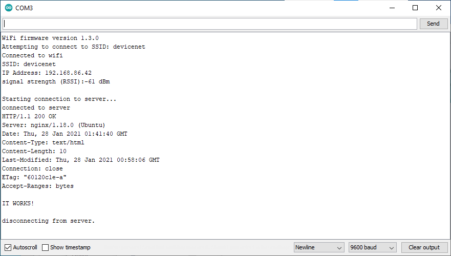

# Exercise 2: Assemble the Hardware

## Wiring - Arduino Nano 33 IoT

Suggested wiring instructions:

1. Place the solderless breadboard with A1 on the bottom left.
1. Plug the Arduino Nano 33 IoT into the breadboard so pin D13 is in D1 on the breadboard.
1. Plug the SHT31 sensor into E27
   * Run a red wire from the positive rail to A27
   * Run a black wire from the negative rail to A28
   * Run a blue wire from B8 (pin A4/SDA on the Arduino) to C30 (SDA on the SHT31)
   * Run a yellow wire from B9 (pin A5/SCL on the Arduino) to B29 (SCL on the SHT31)
1. Plug the LED into D19 and D20. Make sure the longer leg is in D19.
   * Run a 220 &#937; or 330 &#937; resistor from the negative rail to B20
   * Run a green wire from A1 (pin D13 on the Arduino) to B19 (the anode of the LED)
1. Run a red wire from A2 (+3V3 pin on the Arduino) to the positive rail
1. Run a black wire from A14 (GND pin on the Arduino) to the negative rail

The Nano 33 IoT pins are labeled in [this diagram](https://content.arduino.cc/assets/Pinout-NANO33IoT_latest.png).

## Hardware Test

1. Open arduino/HardwareTest/HardwareTest.ino in the Arduino IDE
1. Choose the board _Tools -> Board -> Arduino NANO 33 IoT_
1. Choose the port _Tools -> Port -> COM 3 (Arduino NANO 33 IoT)_ Note that the actual port may be different on your computer
1. Upload the code to the board _Sketch -> Upload_
1. The LED should be a solid color
1. Open the serial monitor _Tools -> Serial Monitor_
1. The LED should start blinking and you should see sensor data in the serial console

## Wiring Arduino MRK WiFi 1010

Suggested wiring instructions:

1. Place the solderless breadboard with A1 on the bottom left.
1. Plug the Arduino MKR WiFi 1010 into the breadboard so the AREF pin is in B1 on the breadboard.
1. Plug the SHT31 sensor so the VIN pin is in EG30 on the breadboard
   * Run a red wire from the positive rail to J30
   * Run a black wire from the negative rail to J29
   * Run a blue wire from J9 (pin 12/SDA on the Arduino) to J28 (SDA on the SHT31)
   * Run a yellow wire from J8 (pin 11/SCL on the Arduino) to J27 (SCL on the SHT31)
1. Plug the LED into D19 and D20. Make sure the longer leg is in F19.
   * Run a 220 &#937; or 330 &#937; resistor from the negative rail to B20
   * Run a green wire from J14 (pin 6 on the Arduino) to J19 (the anode of the LED)
1. Run a red wire from J3 (VCC pin on the Arduino) to the positive rail
1. Run a black wire from J4 (GND pin on the Arduino) to the negative rail

The MKR WiFi 1010 pins are labeled in [this diagram](https://docs.arduino.cc/static/9d6534bb9783a42e3527a8c03472ad10/ABX00023-full-pinout.pdf).

## Hardware Test

1. Open arduino/HardwareTest/HardwareTest.ino in the Arduino IDE
1. Choose the board _Tools -> Board -> Arduino MKR WiFi 1010_
1. Choose the port _Tools -> Port -> COM 3 (Arduino MKR WiFi 1010)_ Note that the actual port may be different on your computer
1. Upload the code to the board _Sketch -> Upload_
1. The LED should be a solid color
1. Open the serial monitor _Tools -> Serial Monitor_
1. The LED should start blinking and you should see sensor data in the serial console

## Register MAC address with ITP Sandbox Network

In order to join the `Sandbox370` wireless network, the MAC address of the device must be registered with [NYU-NET](https://computer.registration.nyu.edu/). Use the [MacAddress sketch](../arduino/MacAddress/MacAddress.ino) to get the MAC address for your device. 

[Tom Igoe's documentation](https://itp.nyu.edu/networks/tutorials/itp-network-connections/) has more details about the process.

## Network Test

1. Open arduino/NetworkTest/NetworkTest.ino in the Arduino IDE
1. Edit the ssid and password on the arduino_secrets.h tab
1. Upload the code to the board _Tools -> Upload_
1. Open the serial monitor _Tools -> Serial Monitor_
1. Look for the message "IT WORKS!"

Next [Exercise 3: Sending data using HTTP](exercise3.md)
