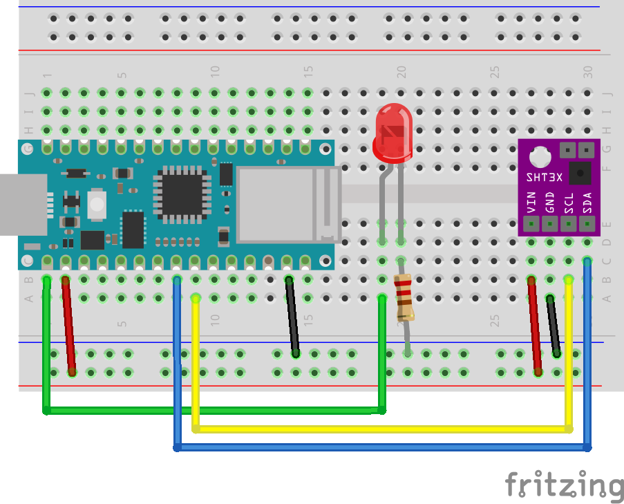
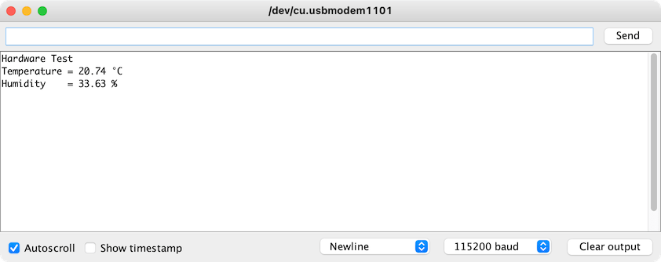

# Exercise 2: Assemble the Hardware

## Wiring

Suggested wiring instructions:

1. Place the solderless breadboard with A1 on the bottom left.
1. Plug the Arduino Nano 33 IoT into the breadboard so pin D13 is in C1 on the breadboard.
1. Plug the DHT22 sensor into E11
   * Run a red wire from the positive rail to A27
   * Run a 10,000 &#937; resistor from the positive rail to A28
   * Run a black wire from the negative rail to A30
   * Run a blue wire from H1 (pin D3 in the Arduino) to B28
1. Plug the LED into D19 and D20. Make sure the longer leg is in D19.
   * Run a 220 &#937; or 330 &#937; resistor from the negative rail to B20
   * Run a green wire from A1 (pin D13 on the Arduino) to B19 (the anode of the LED)
1. Run a red wire from A2 (+3V3 pin on the Arduino) to the positive rail
1. Run a black wire from A14 (GND pin on the Arduino) to the negative rail

The Nano 33 IoT pins are labeled in [this diagram](https://content.arduino.cc/assets/Pinout-NANO33IoT_latest.png).

## Hardware Test

1. Open arduino/HardwareTest/HardwareTest.ino in the Arduino IDE
1. Choose the board _Tools -> Board -> Arduino MKR WiFi 1010_
1. Choose the port _Tools -> Port -> COM 4 (Arduino MKR WiFI 1010)_ Note that the actual port may be different on your computer
1. Upload the code to the board _Sketch -> Upload_
1. The LED should be a solid color
1. Open the serial monitor _Tools -> Serial Monitor_
1. The LED should start blinking and you should see sensor data in the serial console

## Register MAC address with ITP Sandbox Network

If you're using an Arduino from the ER you can skip this step. 

In order to join the `itpsandbox` wireless network, the MAC address of the device must be registered with [NYU-NET](https://computer.registration.nyu.edu/). Use the [MacAddress sketch](../arduino/MacAddress/MacAddress.ino) to get the MAC address for your device. 

[Tom Igoe's documentation](https://itp.nyu.edu/networks/tutorials/itp-network-connections/) has more details about the process.

## Network Test

1. Open arduino/NetworkTest/NetworkTest.ino in the Arduino IDE
1. Edit the ssid and password on the arduino_secrets.h tab
1. Upload the code to the board _Tools -> Upload_
1. Open the serial monitor _Tools -> Serial Monitor_
1. Look for the message "IT WORKS!"

Next [Exercise 3: Sending data using HTTP](exercise3.md)
