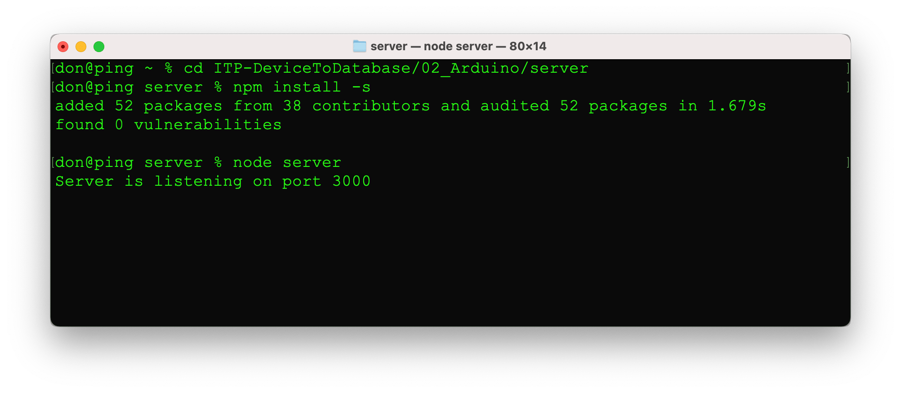
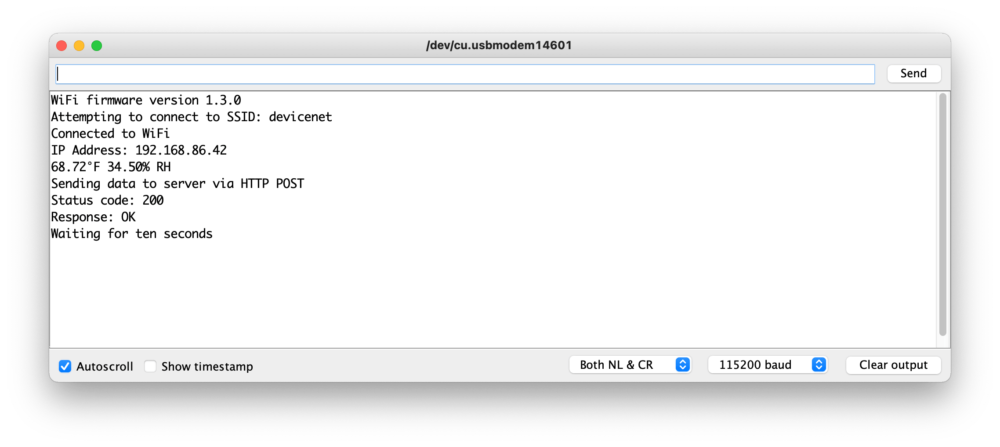
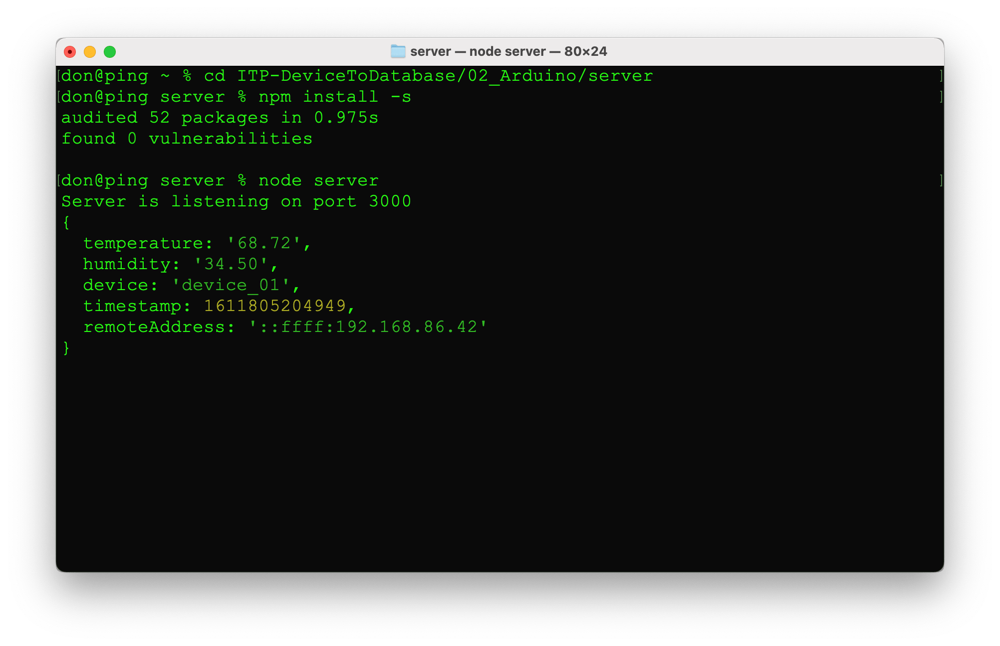
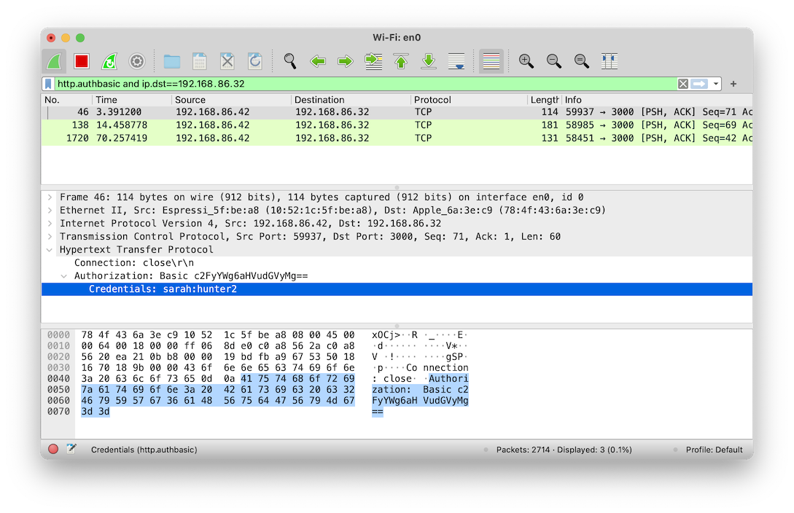
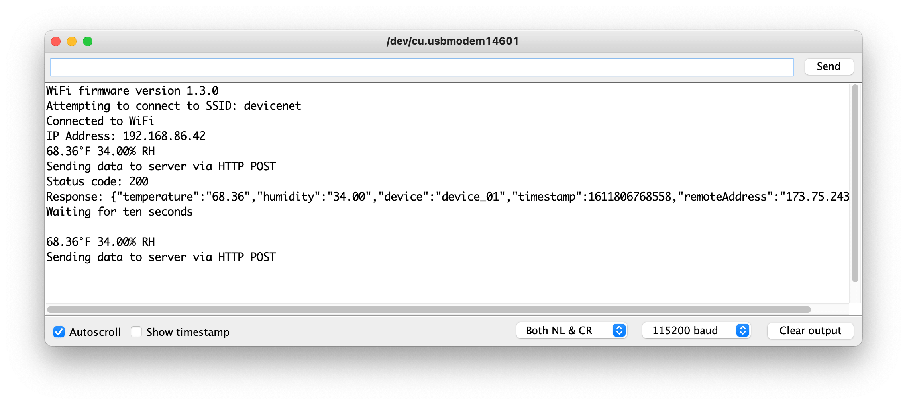
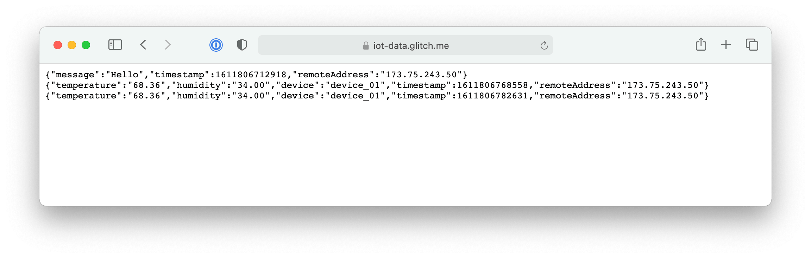

# Exercise 3: Sending data using HTTP

In this module, you will publish temperature and humidity data using HTTP. We will use a very simple server that accepts sensor data via HTTP post. The server is written using Express, a framework for Node.js that lets you create webservers.

        const express = require('express');
        const app = express();
        const bodyParser = require("body-parser");

        app.use(bodyParser.urlencoded({ extended: true }));
        app.use(bodyParser.json());

        app.post("/", function (request, response) {
        // posted data is in the body
        let data = request.body; 
        // add a timestamp
        let dt = new Date();
        data.timestamp = dt.getTime();
        // add the remote address
        let remoteAddress = request.headers['x-forwarded-for'] || request.connection.remoteAddress;
        data.remoteAddress = remoteAddress;
        
        console.log(data);
            response.send();
        });

        // listen for requests :)
        const listener = app.listen(process.env.PORT || '3000', function() {
            console.log('Server is listening on port ' + listener.address().port);
        });

## Server

1. Download and install Node.js 14.15.4 LTS from https://nodejs.org/en/
1. Open a command prompt or terminal
1. Navigate to the server directory under 02_Arduino e.g. *cd ITP_DeviceToDatabase/02_Arduino/server*
1. Run `npm install` to install the dependencies
1. Run `node server.js` to start the server 

## Arduino

Web traffic from the Arudino needs to be able to route to the laptop running the server. The easiest way to do that for this exercise is for the Arduino and the laptop to be on the same network. Note that some networks like nyu and nyuguest block you from running servers on their wireless network.

1. Open arduino/HttpClient/HttpClient.ino in the Arduino IDE
1. Switch to the config.h tab
    1. Update WiFi ssid and password
    1. Add the laptop's IP address
        1. On macos use `ifconfig en0` to get the ip address
        1. On windows use `ipconfig`
    1. Add your device id
1. Deploy the code the Arduino _Sketch -> Upload_
1. Open the serial monitor to view the data _Tools -> Serial Monitor_

The arduino will send data form encoded data. The server will print this data as JSON.

## Saving data 

The server prints any data received to standard output. It would be better if the server logged the data to a file. Stop server.js with Control+C. Start server2.js to print data to the terminal and write it to the data.json file.

    node server2.js

You can view collected data using a web browser http://localhost:3000 or by viewing the data.json file on disk. To clear the data file, visit http://localhost:3000/clear.

## Curl

Since the server accepts data via a HTTP post, you can use tools like curl to send data to your server. This is useful for testing your server (or sending data to your neighbors server.) Replace 192.168.86.32 with the IP address of your server.

    curl -X POST -d message=hello -d name=world 192.168.86.32:3000

Curl can also be used to fetch data

    curl -v 192.168.86.32:3000

## Powershell

Windows users can use Powershell to post data to the server

    Invoke-WebRequest -Uri http://192.168.86.32:3000 -Method POST -Body message="Hello from Powershell" -UseBasicParsing

## Authenticating users and devices

Anyone can connect and post data to the server. Typically a server will require users and devices to login with a username and password. The next version, server3.js use basic authentication to authenticate clients. Stop server2.js using Control+C.  Start server3.

    node server3.js

Request from HttpClient will begin to fail with 401 when you start the new server. 

1. Open arduino/HttpClientBasicAuth/HttpHttpClientBasicAuthClient.ino in the Arduino IDE
1. Switch to the config.h tab
    1. Update WiFi ssid and password
    1. Add the laptop's IP address
    1. Add a http user and password (Look at the user and passwords in server3.js source code.)
    1. Add your device id
1. Deploy the code the Arduino _Sketch -> Upload_
1. Open the serial monitor to view the data _Tools -> Serial Monitor_

What happens now when you visit http://localhost:3000 in a web browser?

You can add and modify the users and passwords in server3.js. Restart the server after saving edits.

## Encryption

So far, we've been sending data over HTTP which is plaintext. This isn't good. When our data isn't encrypted, anyone on the network can intercept and view our data. [Wireshark](https://www.wireshark.org/) is a tool that lets you capture and inspect network traffic. From the screenshot below, you can see Sarah's password because the connection between the Arduino and the server is not encrypted.

Using HTTPS with TLS certificates protects our data in transit. When you switch to TLS, you need to use the WiFiSSLClient in the Arduino code instead of WiFiClient. We could add HTTPS support to our node server, but that's a lot of work. A more typical setup is to have a webserver like Nginx handling TLS and then proxing traffic to the Node application. That's too much for this exercise. Fortunately [glitch.com](https://glitch.com/) makes it easy to run node.js server code from their website. Glitch has TLS certificates setup for running HTTPS too. 

1. Open arduino/HttpClient/HttpClient.ino in the Arduino IDE
1. Switch to the config.h tab
    1. Change the server to `iot-data.glitch.me`
    1. Change the port from 3000 to 443
1. Switch to the HttpClient tab
    1. Comment out the WiFiClient line
    1. Uncomment the WiFiSSLClient line
1. Deploy the code the Arduino _Sketch -> Upload_
1. Open the serial monitor to view the data _Tools -> Serial Monitor_

You can view the data by loading https://iot-data.glitch.me/ in your browser. You'll need to refresh the browser to see new data. 

## Challenge
Fork the [iot-data project](https://glitch.com/~iot-data) on Glitch. Modify your Arduino code to send data to your new server address. Modify the Glitch project to require a username and password. Note that anyone can view the source of your Glitch project, so you'll want to store the actual username and passwords in .env. See the Glitch help center for more info on [storing credentials](https://glitch.com/help/env/).

Next [Exercise 4: Sending Data using MQTT](exercise4.md)

