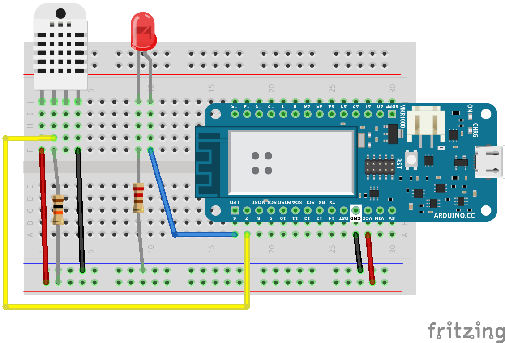
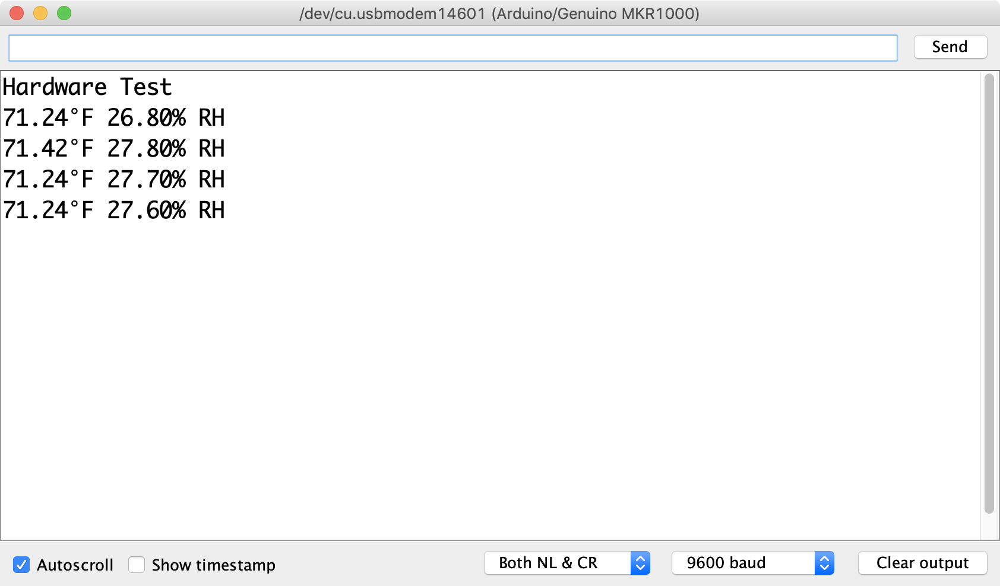
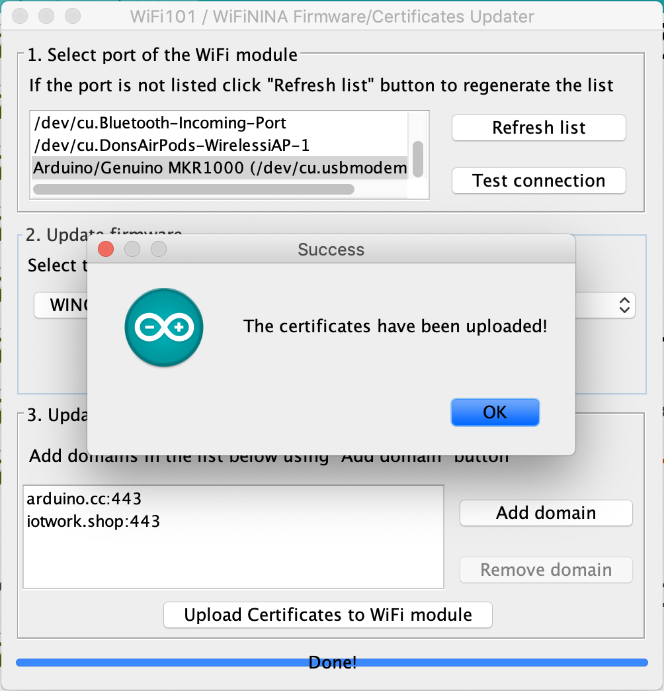
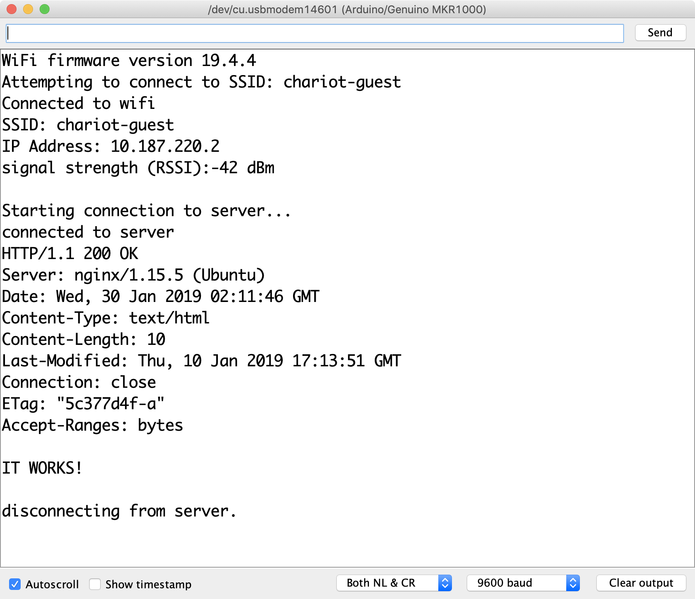

# Exercise 2: Assemble the Hardware

## Wiring

Suggested wiring instructions:

1. Place the solderless breadboard with A1 on the bottom left.
1. Plug the Arduino MKR WiFi 1000 into the breadboard with the 5V pin in C30.
1. Plug the DHT-22 into J1.
   * Use a red wire from the positive rail to F1
   * Add a 10,000 &#937; resistor (brown, black, orange, gold) from the positive rail to F2.
   * Place a black wire from the negative rail to F4
   * Run a yellow wire from G2 to A18 which is pin 7 on the Arduino.
1. Plug the LED into J9 and J10. Make sure the longer leg is in J10.
   * Run a 220 &#937; or 330 &#937; resistor from the negative rail to F9
   * Run a blue wire from F10 to A17 which is pin 6 on the Arduino.
1. Run a black wire from A27 to the negative rail
1. Run a red wire from A28 to the positive rail

## Hardware Test

1. Open arduino/HardwareTest/HardwareTest.ino in the Arduino IDE
1. Choose the board _Tools -> Board -> Arduino MKR WiFi 1010_
1. Choose the port _Tools -> Port -> COM 3 (Arduino MKR WiFI 1010)_ Note that the actual port may be different on your computer
1. Upload the code to the board _Sketch -> Upload_
1. The LED should be a solid color
1. Open the serial monitor _Tools -> Serial Monitor_
1. The LED should start blinking and you should see temperature, humidity, CdS, button, & servo data in the serial console
1. To stop the program press the RST button on the board.
    * To restart the test, close the _Serial Monitor_ dialog and open it again.

## Register MAC address with ITP Sandbox Network

If you're using an Arduino from the ER you can skip this step. 

In order to join the `itpsandbox` wireless network, the MAC address of the device must be registered with [NYU-NET](https://computer.registration.nyu.edu/). Use the [MacAddress sketch](../arduino/MacAddress/MacAddress.ino) to get the MAC address for your device. 

[Tom Igoe's documentation](https://itp.nyu.edu/networks/tutorials/itp-network-connections/) has more details about the process.

## Update TLS Certificates

Skip this section if you're using a MKR WiFi 1010.

The MKR1000 needs the root certifcates for any websites accessed via SSL. There is a utility to fetch and store these certificates.

1. Open the WiFi101 FirmwareUpdater sketch _File -> Examples -> WiFi101 -> FirmwareUpdater_
1. Upload the code to the board _Sketch -> Upload_
1. Open the Firmware Updater _Tools -> WiFi101 / WiFiNINA Firmware Updater_
1. Select the port of your MKR1000 in section 1
1. Click the "Add Domain" button in section 3
1. Enter "iotwork.shop" and press the OK button
1. Press the "Upload Certificates to WiFi module" button
1. Wait for the success message

For more information see the Certificate Uploading section of the [WiFi101 Documentation](https://www.arduino.cc/en/Tutorial/FirmwareUpdater)

## Network Test

1. Open arduino/NetworkTest/NetworkTest.ino in the Arduino IDE
1. Edit the ssid and password on the arduino_secrets.h tab
1. Upload the code to the board _Tools -> Upload_
1. Open the serial monitor _Tools -> Serial Monitor_
1. Look for the message "IT WORKS!"

Next [Exercise 3: Sending data using MQTT](exercise3.md)
