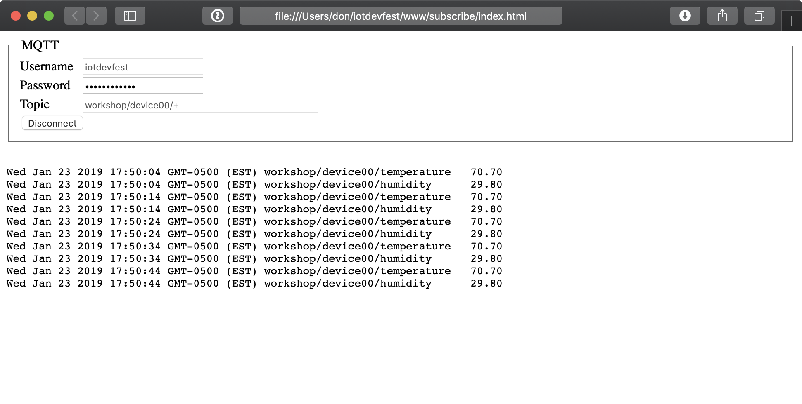

# Exercise 4: Viewing MQTT data

In the last module, the Arduino was publishing data using MQTT messages. In this module, we will write code to subscribe to MQTT topics and view the messages.

1. Open www/subscribe/index.html in your browser
1. Enter your username and password
1. Press connect to view all data using the **#** wildcard
1. Disconnect
1. Change the topic name to display the temperature from your device "itp/deviceX/temperature"
1. Disconnect
1. Use the **+** wildcard to view all the data from your device "itp/deviceX/+"
1. Disconnect
1. Try the **+** wildcard to view everyone’s humidity data "itp/+/humidity"
1. Experiment with some additional topic using wildcards
1. Open www/subscribe/index.js and examine the MQTT code
1. Try adjusting how the data is displayed on the page

Next [Exercise 5: Graphing MQTT Data](exercise5.md)