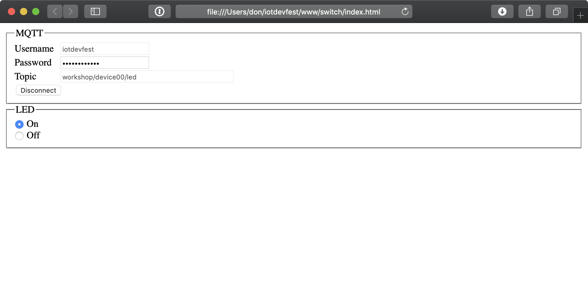

# Exercise 6: Sending Data to Arduino

In the previous examples, the Arduino published data using MQTT messages. The Arduino can also subscribe to a MQTT topic.

1. Open arduino/LED/LED.ino in the Arduino IDE
1. Switch to the config.h tab
1. Update WiFi ssid and password
1. Add the MQTT broker URL, username, and password
1. Add your device id
1. Deploy the code the Arduino _Sketch -> Upload_
1. Open the serial monitor _Tools -> Serial Monitor_

The Arduino should now be connected to the network and waiting for MQTT messages.

1. Open www/switch/index.html in your web browser
1. Enter your username and password
1. Change deviceX to your device id
1. Press connect
1. Use the radio buttons to control the LED on your Arduino

The Arduino can publish and subscribe to MQTT messages at the same time. The [TemperatureHumidityLED sketch](/arduino/TemperatureHumidityLED/TemperatureHumidityLED.ino) demonstrates the Arduino publishing messages to temperature and humidity topics, while subscribing to the LED topic.

# Challenge: Dimmable LED

Edit the Arudino code and make the LED dimmable. Add a [range control](https://developer.mozilla.org/en-US/docs/Web/HTML/Element/input/range) to the HTML page. Allow the user to use the radio buttons or the range control to adjust the LED.

Next [Exercise 7: Connecting using X.509 certs](exercise7.md)
