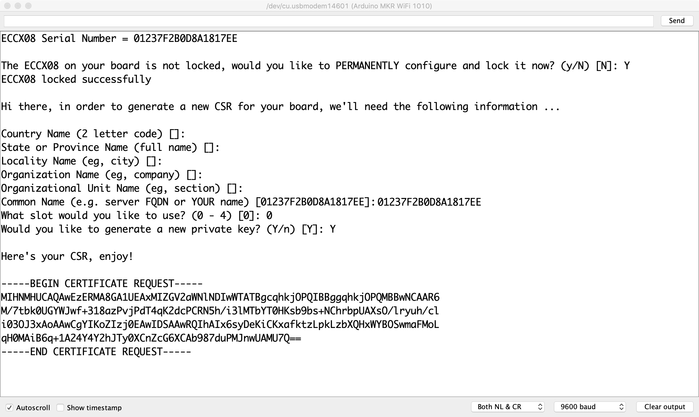
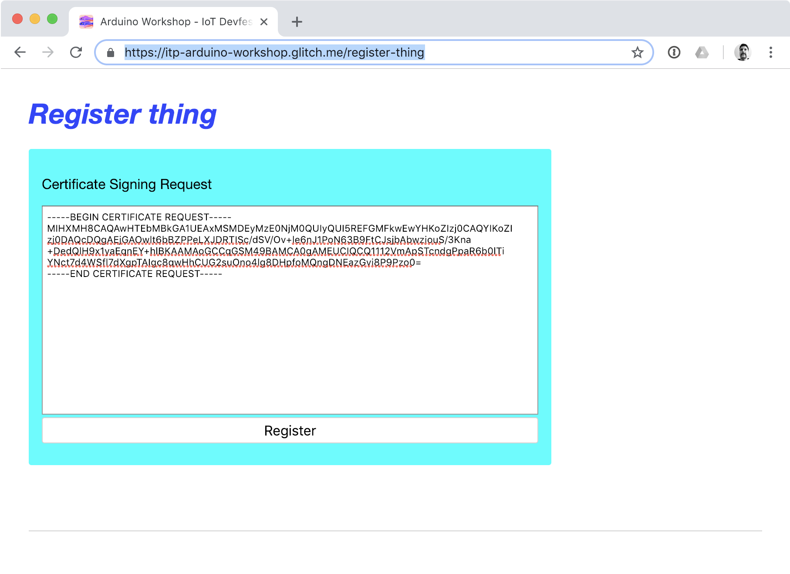
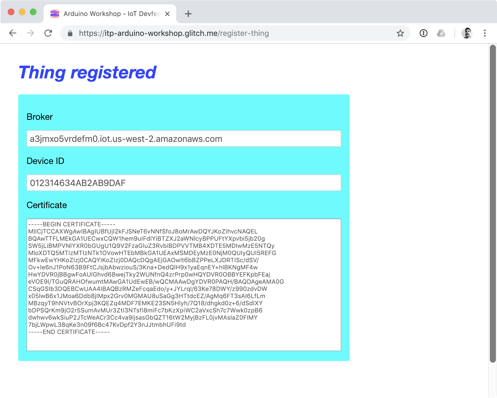
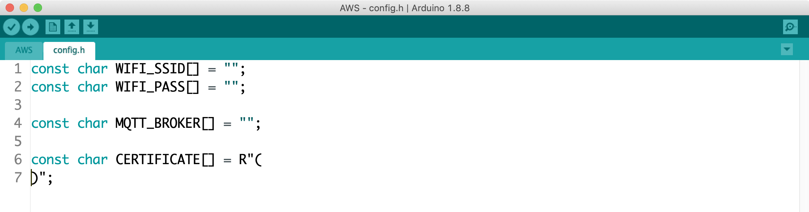
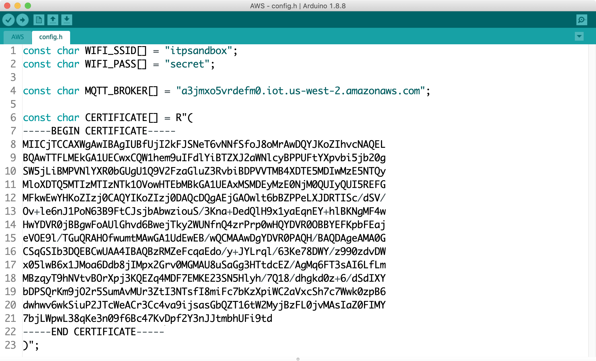

# Exercise 7 - Connecting using X.509 certs

AWS requires client certificates to securely authenticate devices with IoT Core. The Arduino 1010 has a crypto element for generating and storing keys. First we need to run code on the Arduino to generate a private key and a Certificate Signing Request (CSR).

1. Open arduino/ECCX08CSR/ECCX08CSR.ino in the Arduino IDE.
1. Upload the code to the board _Sketch -> Upload_
1. Open the serial monitor _Tools -> Serial Monitor_.
1. Make sure the new line setting in the bottom of the window is set to "Both NL & CR".
1. Follow the prompts in the serial monitor. 
1. Enter Y to permanently lock the crypto element. Locking the element is required to generate private keys on the device.
1. Hit enter 5 times to skip the location and organization information.
1. The Common Name is pre-populated with the serial number from your the crypto element. Hit enter to use the serial number as the common name.
1. Choose slot 0 for the key
1. Enter Y to generate the private key
1. A CSR will be printed out. Select and copy this text including the dashes and BEGIN and END request text.

Now that we have a CSR, we need to create a device in AWS IoT and get a certificate. This process can be done through the AWS Management Console or with the AWS API. For this workshop, we created a web form to automate the process.

1. Open https://itp-arduino-workshop.glitch.me/
1. Login with the username and password provided by the instructors
1. Click Register Thing
1. Copy the CSR generated by Arduino and paste it into the form
1. Click register
1. Keep this browser window open for the next step

Next, we add the generated certificate to our Arduino code. The ArduinoBearSSL library uses the certificate and private key to authenticate with the AWS server in place of a username and password.

1. Open arduino/AWS/AWS.ino in the Arudino IDE.
1. Switch to the config.h tab
1. Update the wifi SSID and password
1. Copy the broker URL from registration form and paste it into config.h
1. Copy the certificate from registration form and paste it into config.h
1. Deploy the code the Arduino _Sketch -> Upload_

More information on using the MKR WiFi 1010 with AWS IoT can be found in the following tutorial: [Securely Connecting an Arduino MKR WiFi 1010 to AWS IoT Core](https://create.arduino.cc/projecthub/Arduino_Genuino/securely-connecting-an-arduino-mkr-wifi-1010-to-aws-iot-core-a9f365?ref=search&ref_id=AWS%20IoT%20core&offset=1)

Next [Exercise 8: Running the Prototype](exercise8.md)