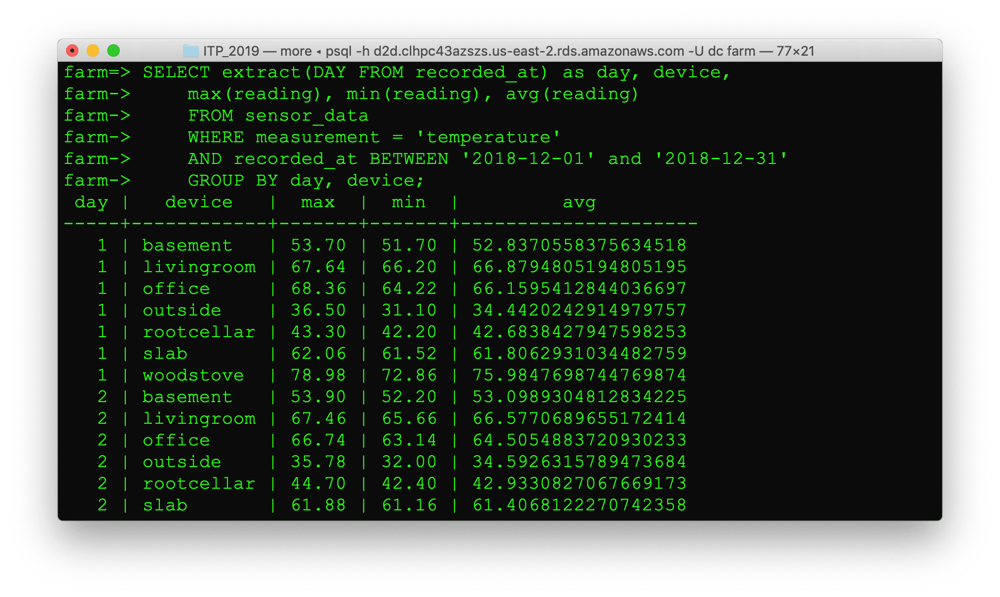
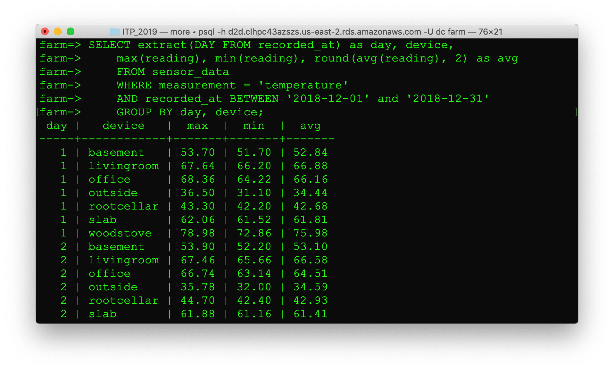

The `farm` database is another set of sensor data you can query. After you've connected with psql, switch to the farm database using `\c farm`. Use `\d` to describe the `sensor_data` table. It has the same structure as the `sensor_data` table in `itp` database.

    \d sensor_data

Run some queries to get an idea what the data looks like. 

Count the number of records.

    SELECT count(*) FROM sensor_data;

Select a few sample rows.

    SELECT * FROM sensor_data LIMIT 10;

Order by `id desc` to show the newest data first.

    SELECT * FROM sensor_data ORDER BY id desc LIMIT 10;

Use `distinct` to see the devices and measurements.

    SELECT distinct device FROM sensor_data;
    SELECT distinct measurement FROM sensor_data;

How many rows do we have for each device?

    SELECT device, count(*) FROM sensor_data GROUP BY device;

How many rows do we have for each measurement?

    SELECT measurement, count(*) FROM sensor_data GROUP BY measurement;

We can also do math in the query to adjust how the data is displayed.

    SELECT measurement, round(count(*)/1000000.0, 2) as million
        FROM sensor_data
        GROUP BY measurement;

When was the data recorded?

    SELECT device, min(recorded_at), max(recorded_at)
        FROM sensor_data
        GROUP BY device;

Let's get all the temperature readings for a specific time period: December 2018.

    SELECT * 
        FROM sensor_data 
        WHERE measurement = 'temperature' 
        AND recorded_at BETWEEN '2018-12-01' and '2018-12-31';

Adjust the query to limit the number or columns in the result set.

    SELECT recorded_at, device, reading
        FROM sensor_data 
        WHERE measurement = 'temperature' 
        AND recorded_at BETWEEN '2018-12-01' and '2018-12-31';

This is still a lot of data, we can roll this up by day.

    SELECT extract(DAY FROM recorded_at) as day, device, 
        max(reading), min(reading), avg(reading)
        FROM sensor_data
        WHERE measurement = 'temperature'
        AND recorded_at BETWEEN '2018-12-01' and '2018-12-31'
        GROUP BY day, device;

Round the average temperature column to make the results look better.

    SELECT extract(DAY FROM recorded_at) as day, device, 
        max(reading), min(reading), round(avg(reading), 2) as avg
        FROM sensor_data
        WHERE measurement = 'temperature'
        AND recorded_at BETWEEN '2018-12-01' and '2018-12-31'
        GROUP BY day, device;

Using day works OK for one month but will fail if we expand the date to include January because December 1st and January 1st will both get grouped into day 1. Another method we can use to group by day is to cast the `recorded_at` timestamp column to a date using `::date`.

    SELECT recorded_at::date as day, device, 
        max(reading), min(reading), round(avg(reading), 2) as avg
        FROM sensor_data
        WHERE measurement = 'temperature'
        AND recorded_at BETWEEN '2018-12-01' and '2018-12-31'
        GROUP BY day, device;

We can add an `order by` to change how the data is returned.

    SELECT recorded_at::date as day, device, 
        max(reading), min(reading), round(avg(reading), 2) as avg
        FROM sensor_data
        WHERE measurement = 'temperature'
        AND recorded_at BETWEEN '2018-12-01' and '2018-12-31'
        GROUP BY day, device
        ORDER BY device, day;

The WHERE clause can be used to limit which devices are returned. 

    SELECT * 
        FROM sensor_data 
        WHERE device = 'office'
        AND measurement = 'temperature';

We can select multiple devices using `OR`.

    SELECT * 
        FROM sensor_data 
        WHERE (device = 'office' OR device = 'livingroom' OR device = 'slab')
        AND measurement = 'temperature';

A better way to select multiple devices is to use the 'IN' clause.

    SELECT recorded_at::date as day, device, 
            max(reading), min(reading), round(avg(reading), 2) as avg
        FROM sensor_data
        WHERE measurement = 'temperature'
        AND device IN ('office', 'livingroom', 'slab')
        AND recorded_at BETWEEN '2018-12-01' and '2018-12-31'
        GROUP BY day, device;

We can roll up data in smaller increments such as hour of the day.

    SELECT recorded_at::date as date, extract(HOUR FROM recorded_at) as hour, 
            device, max(reading), min(reading), round(avg(reading), 2) as avg 
        FROM sensor_data 
        WHERE measurement = 'temperature' 
        AND device = 'office'
        AND recorded_at BETWEEN '2018-12-10' and '2018-12-11' 
        GROUP BY date, hour, device;

We can roll up data in four hour chunks. Dividing by 4 then multiplying by 4 works because of integer division. The hour was cast to an integer. When hour is divided by 4, the quotient is kept but the remainder is dropped. This means 0/4, 1/4, 2/4, 3/4 all end up as 0. 4/4, 4/5, 6/4, 7/4 all become 1, etc. This behavior allows us to segment the data into 4 hour buckets.

    SELECT recorded_at::date as date, 
            extract(HOUR FROM recorded_at)::integer/4 * 4 as hour_4, 
            device, max(reading), min(reading), round(avg(reading), 2) as avg 
        FROM sensor_data 
        WHERE measurement = 'temperature' 
        AND device = 'office'
        AND recorded_at BETWEEN '2018-12-10' and '2018-12-11' 
        GROUP BY date, hour_4, device;

We can also group into 15 minute chunks. Extracting the `epoch` gives us the UTC timestamp in seconds. 900 seconds is 15 minutes.

    SELECT recorded_at::date as date, 
            extract(EPOCH FROM recorded_at)::integer/900 * 900 as minute_15, 
            device, max(reading), min(reading), round(avg(reading), 2) as avg 
        FROM sensor_data 
        WHERE measurement = 'temperature' 
        AND device = 'office'
        AND recorded_at BETWEEN '2018-12-10T12:00:00' and '2018-12-10T14:00:00' 
        GROUP BY date, minute_15, device;

That worked but the minute column is difficult to understand. The epoch can be converted back to a datetime with to_timestamp.

    SELECT recorded_at::date as date, 
            to_timestamp(extract(EPOCH FROM recorded_at)::integer/900 * 900) as minute_15, 
            device, max(reading), min(reading), round(avg(reading), 2) as avg 
        FROM sensor_data 
        WHERE measurement = 'temperature' 
        AND device = 'office'
        AND recorded_at BETWEEN '2018-12-10T12:00:00' and '2018-12-10T14:00:00' 
        GROUP BY date, minute_15, device;

Now that we've formatted the timestamp column, we can drop the date column since it's redundant.

    SELECT to_timestamp(extract(EPOCH FROM recorded_at)::integer/900 * 900) as minute_15, 
            device, max(reading), min(reading), round(avg(reading), 2) as avg 
        FROM sensor_data 
        WHERE measurement = 'temperature' 
        AND device = 'office'
        AND recorded_at BETWEEN '2018-12-10T12:00:00' and '2018-12-10T14:00:00' 
        GROUP BY minute_15, device;

We can also create views in our database. Views are queries that act like tables.

    CREATE VIEW v_temperature AS
        SELECT id, device, reading as temperature recorded_at
            FROM sensor_data
            WHERE measurement = 'temperature';

You can select from a view just like it's a table.

    SELECT *
        FROM v_temperature 
        WHERE device = 'outside'
        AND temperature > 100;

View can be more complex and roll up data. For example, you could create a view that had min, max, and average daily temperatures.

    CREATE VIEW v_daily_temp AS
        SELECT recorded_at::date as day, device, 
                max(reading), min(reading), round(avg(reading), 2) as avg
            FROM sensor_data
            WHERE measurement = 'temperature'
            GROUP BY day, device;

Now you can easily get the min, max, and average temperatures for any day.

    SELECT * FROM v_daily_temp WHERE day = '2018-12-01';

&copy; 2019 Don Coleman

