# Databases

"A database is an organized collection of data, generally stored and accessed electronically from a computer system."
https://en.wikipedia.org/wiki/Database

## Relational Database
 
 * Stores data in a schema
 * Create, Read, Update, Delete (CRUD) via Structured Query Language (SQL)
 * Data integrity - constraints make sure data is reliable and accurate
 * Well documented and mature

Oracle, SQLServer, DB2, MySQL, PostgreSQL, SQLite

Relational database store data in tables. Tables have rows and columns. The columns and data types are specified when creating a table. We use SQL to run queries against the tables and get a result set back. SQL is makes relational databases powerful. SQL gives us a structured well documented way to select, filter, and aggregate data.

### Other types of Databases

Some NoSQL or non-relational databases.

   * Columnar - Hadoop/HBase, Casandra, Bigtable
   * Document - MongoDB, CouchDB
   * KeyValue - Riak, MemcacheDB
   * Graph - Neo4J
   * TimeSeries - InfluxDB, TimescaleDB
 
 https://en.wikipedia.org/wiki/NoSQL
  
## Stuff we're skipping

We are ignoring the relational part of relational databases for now. We're going to store our data in one table and query it. Typically a database has multiple tables and relationships between those tables. Data is normalized so that data is never stored in two places. Queries join the tables to access data. 

Often with a database you're performing CRUD operations: Create, Read, Update, Delete. Since we're dealing with *time series* data from sensors, our use-case is a bit different. We have a process that reads all messages from MQTT and inserts new rows into the database table creating records. We will run queries to read this data and returm results. We won't be updating and deleting records. Time series is Create & Read rather than CRUD. 

## PostgreSQL

A database typically lives on a server, but you could run one on your laptop. Today we're running PostgreSQL on Amazon Web Services. (See [setup/postgresql.md](../setup/postgresql.md) for more details.)

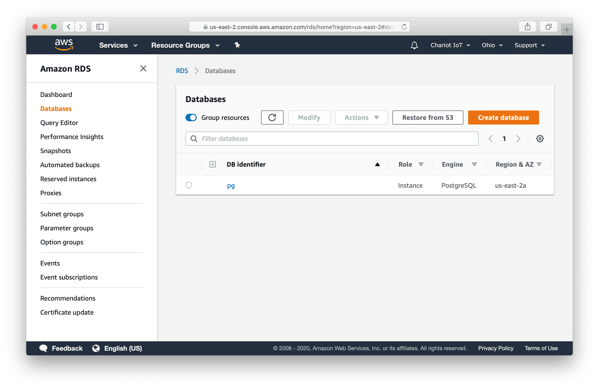

 * [AWS RDS Pricing](https://aws.amazon.com/rds/postgresql/pricing/)
 * [AWS DB Instance Class](https://docs.aws.amazon.com/AmazonRDS/latest/UserGuide/Concepts.DBInstanceClass.html)
 * [AWS Educate](https://www.awseducate.com)

How do you get access to a database? We need a client. 

### Clients

Postgres has a command line client `psql`. We'll start there. There are also GUI clients like [pgAdmin](https://pgadmin.org). There are more generic database tools like [JetBrains DataGrip](https://www.jetbrains.com/datagrip/) and lots of open source database tools. JetBrains makes excellent tools and they have [free licenses for students](https://www.jetbrains.com/student/).

### psql

We're going to start by connecting with `psql`. You can install psql on your computer by installing Postgres. 

#### Mac

The easiest way to install the psql command line tools on a Mac is to use the Homebrew package manager. Install Homebrew by following the directions at https://brew.sh. Then install Postgres with:

    brew install postgresql

We are only using the command line tools. You do **not** need to start the postgresql service.

#### Windows

Windows users should download the PostgreSQL 12 installer from EnterpriseDB https://www.enterprisedb.com/downloads/postgres-postgresql-downloads. During the installation you only need to install the command line tools. Optionally install the pgAdmin 4 GUI. You can uncheck PostgreSQL Server and Stack Builder.

 
## Connecting

The `psql` application runs from the command line. Open a new terminal. Spotlight search for Terminal or in Finder open Applications -> Utilities and double click on Terminal.

The database server is specified using the host, `-h` flag and your user name with `-U`. Try `psql --help` or `man psql` from more details about the command. Replace `xx` in this command with your username.

    psql -h pg.itpdtd.com -U xx

## Creating a table

Now that we are connected to the database, we need a table to store our data. Let's start by saving the data MQTT direcly it in a table. A MQTT messages consist of a topic and a payload of data. We can store the data as text. We also want to record the date and time when we stored the record. The database can automatically add the time by specifying a default value of CURRENT_TIMESTAMP for the column. Most of the time with relational databases, every row of data should have a unique identifer that is the primary key. We use SERIAL type so that the database inserts a unique integer for us.

    CREATE TABLE mqtt_message (
        id SERIAL PRIMARY KEY,
        topic TEXT NOT NULL,
        payload TEXT,
        recorded_at TIMESTAMPTZ NOT NULL DEFAULT CURRENT_TIMESTAMP
    );

Selecting from the table returns an an empty result set.

    SELECT * FROM mqtt_message;

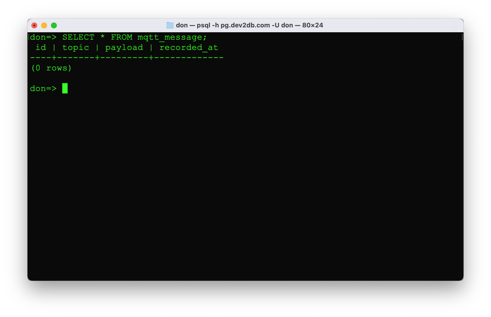

We can insert a record.

    INSERT INTO mqtt_message (topic, payload) VALUES ('test', 'hello, world');

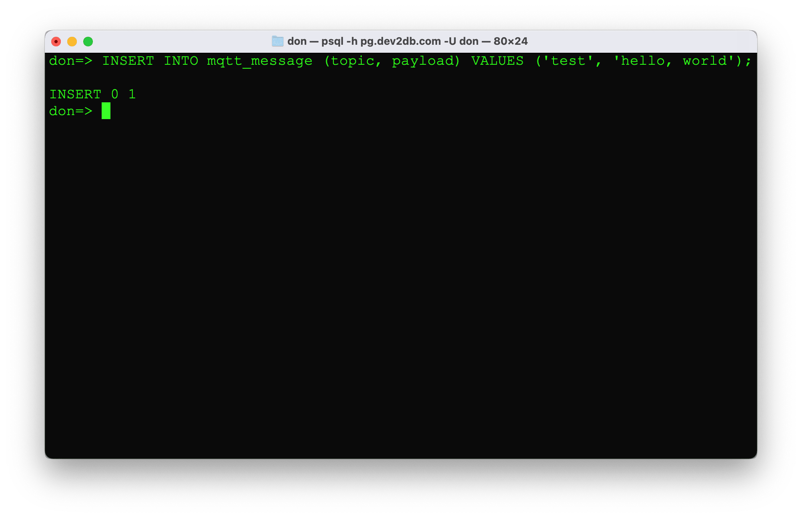

We can retrieve the record.

    SELECT * FROM mqtt_message;

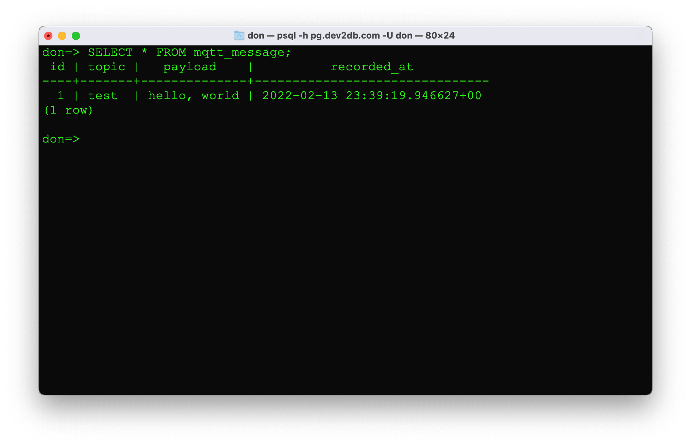

Notice that id and recorded_at are both populated in the row that was inserted. The database automatically added these values based on our table definition.

Inserts some additional records.

    INSERT INTO mqtt_message (topic, payload) VALUES ('test', 'hi');
    INSERT INTO mqtt_message (topic, payload) VALUES ('itp/device12/temperature', 72.4);

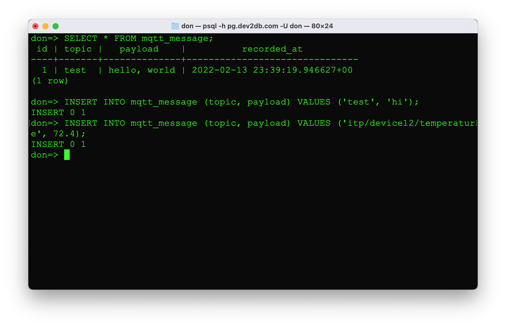

Run the select query again to view all the records.    

    SELECT * FROM mqtt_message;

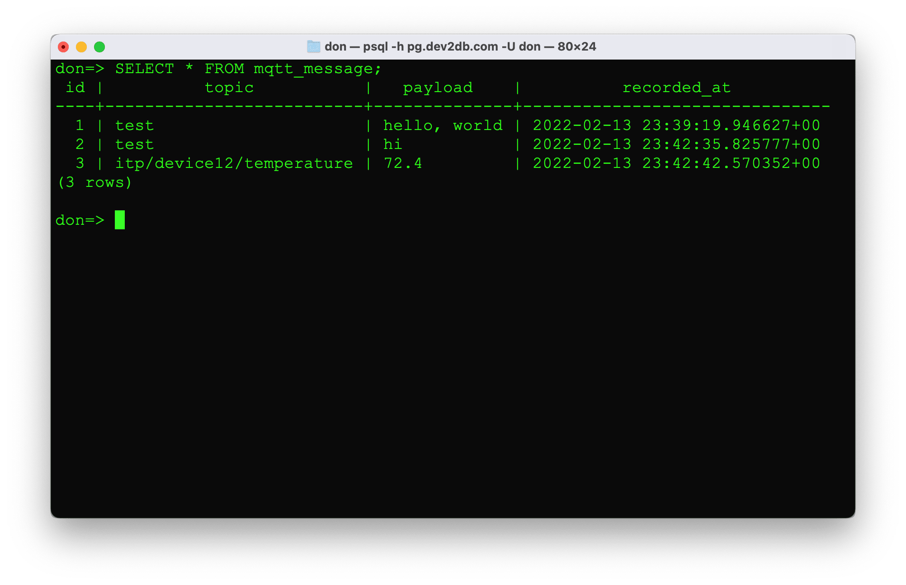

Now that you have learned to insert data into the database manually, we want to automatically insert every MQTT message into the table. There is a Node.js program running on the server the that subscribes to all MQTT topics and inserts the data into the `mqtt_messages` table in the `itp` database. 

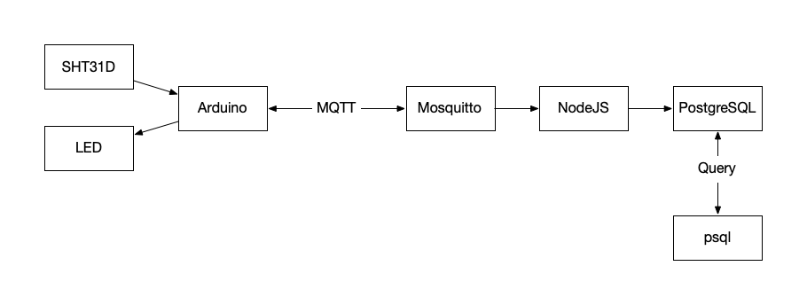

 Let's take a look at this data. The database `itp` is running in the same PostgreSQL instance. Use `\c itp` to switch to a new database. Use `\d mqtt_message` to describe the mqtt_message table. It looks just like the table we created before.

    \c itp
    \d mqtt_message

## Using SQL to look at Sensor Data

What's the shape of the data in this table? How many records are there? What does it look like? We're going to use Structured Query Language or SQL to query the data. SQL queries allow us to extract useful info out of a big pile of data.

Use `count` to see how many records are in the table.

    SELECT count(*) FROM mqtt_message;

Use `distinct` to get the unique set of values in a column.

    SELECT distinct topic FROM mqtt_message;

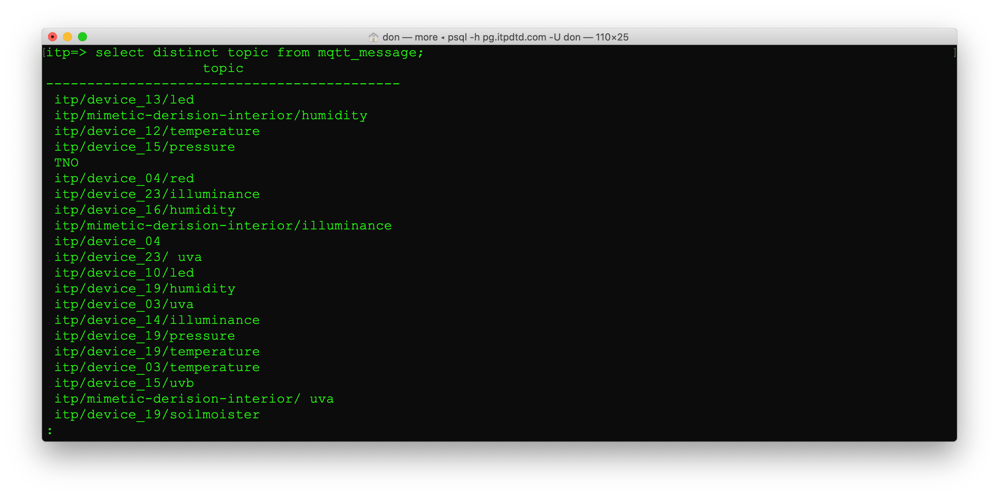

Use `where` to choose which records are returned

    SELECT * FROM mqtt_message WHERE topic = 'itp/device_03/temperature';

Use `like` when you have a wildcard `%` in the where clause.

    SELECT * FROM mqtt_message WHERE topic LIKE 'itp/device_03/%';

This works OK but it's a bit clunky using the wildcard in the topic. It would be nice if device and column were in separate columns. The bigger problem is the temperature is stored as an TEXT or VARCHAR column rather than a number. 

I created a `sensor_data` table to break out the device and measurement from the topic into separate columns. It also stores the data point or reading as number.

    \d sensor_data

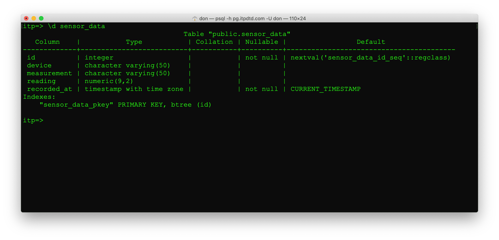

The `sensor_data` table works for most of the incoming data. However, it broke when some devices started sending color data as hex values `#00ff00`. Technically this could be stored as a 3 byte value or 24 bit integer, but that's clunky. Storing the hex value works better as a String. There's another table `sensor_data_text` for text based sensor data.

    \d sensor_data_text

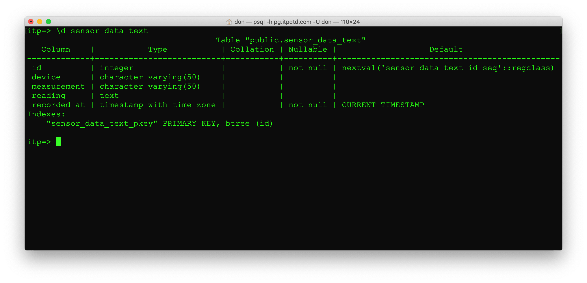

There are Node.js scripts populating the `sensor_data` and `sensor_data_text` tables from MQTT messages. Let's run some queries to look at the data.

    SELECT count(*) FROM sensor_data;

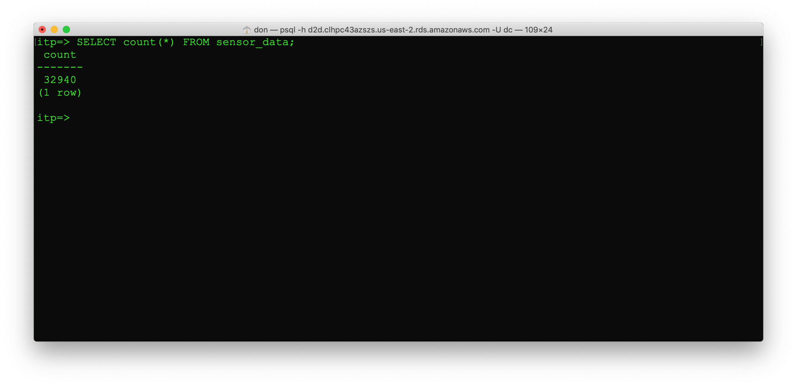

    SELECT distinct device FROM sensor_data;

    SELECT distinct measurement FROM sensor_data;

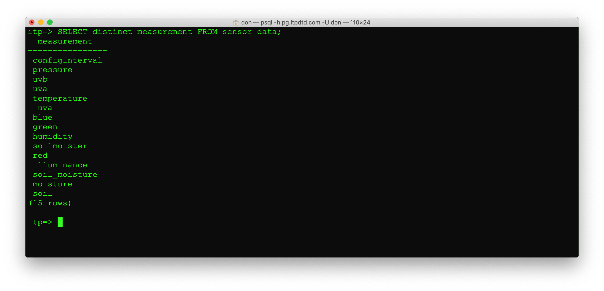

    SELECT distinct measurement FROM sensor_data_text;

A `union` allows us to combine two queries into one result set so we can view all the measurement types from sensor_data combined with sensor_data_text;

    SELECT distinct measurement FROM sensor_data
        UNION
    SELECT distinct measurement FROM sensor_data_text ORDER BY 1;

We can add a `where` clause to only return temperature records. Use the arrow keys to scroll down and view more records.

    SELECT * FROM sensor_data WHERE measurement = 'temperature';

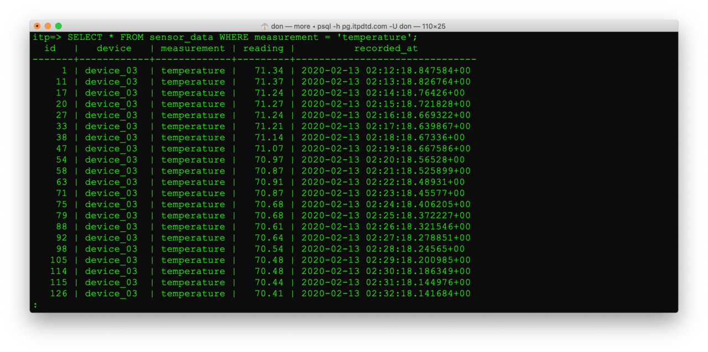

That's a lot of data. Often times we want to `limit` the number of rows returned.

    SELECT * FROM sensor_data WHERE measurement = 'temperature' LIMIT 10;

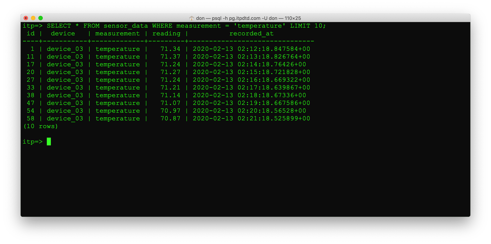

The asterisk or `*` in the field definitions returns all the columns in the order they were defined. We can choose only the column or columns we care about by explictly listing the column names in the query.

    SELECT reading FROM sensor_data WHERE measurement = 'temperature' LIMIT 10;

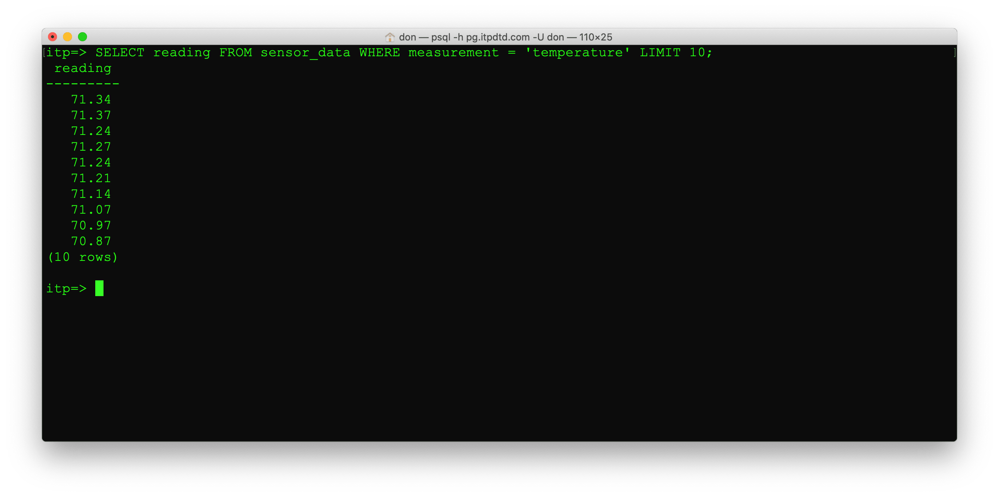

    SELECT device, reading FROM sensor_data WHERE measurement = 'temperature' LIMIT 10;

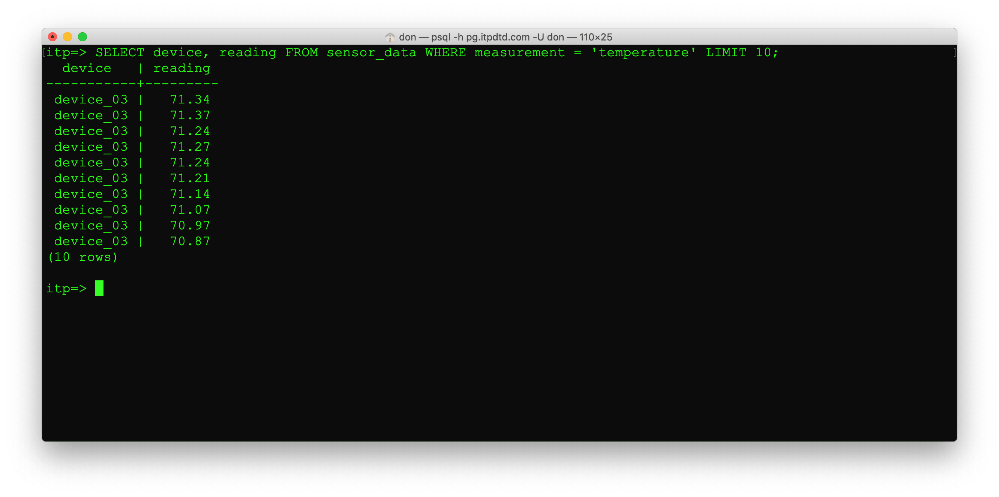

All these queries are similar to what we did with the `mqtt_message` table. The `sensor_data` table stores the reading as a number which allows us to aggregate data. We can get the minimum temperature that is stored in the database.

    SELECT min(reading) FROM sensor_data WHERE measurement = 'temperature';

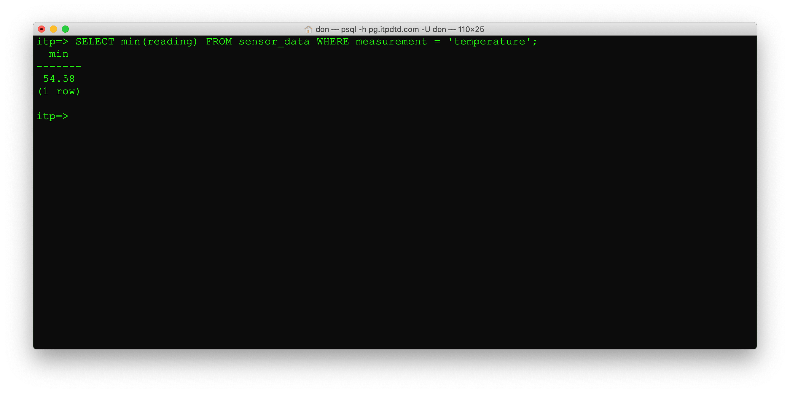

The minimum temperature would be better if we could see it *per device*.

    SELECT device, min(reading) FROM sensor_data WHERE measurement = 'temperature';

**This gives us an error** because we are selecting a column and an aggregate function. We need to `group by` the `device` column to make this query work.

    SELECT device, min(reading) FROM sensor_data WHERE measurement = 'temperature' GROUP BY device;

We can include the min and max for each device in one query.

    SELECT device, min(reading), max(reading) 
        FROM sensor_data 
        WHERE measurement = 'temperature' 
        GROUP BY device;

We can also limit our queries by time.

    SELECT * FROM sensor_data 
        WHERE recorded_at BETWEEN '2020-02-14' AND '2020-02-15';

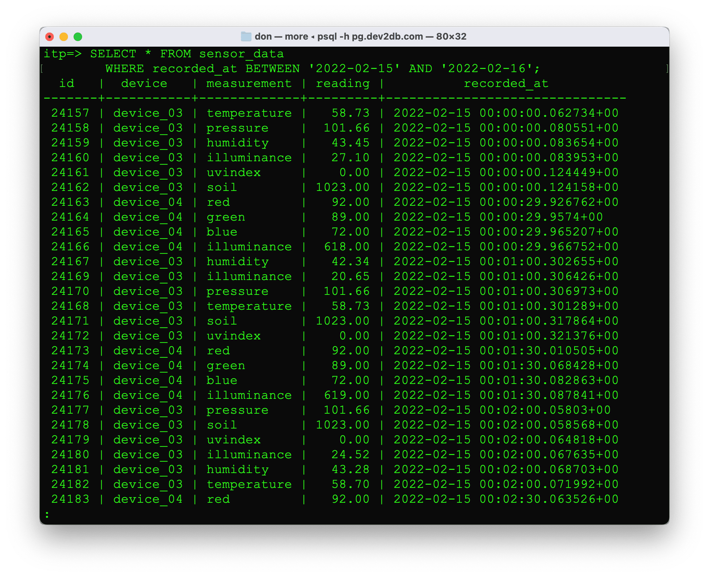

If you look closely at the dates in that last query, they have a time zone offset of zero. Notice the `+00` at the end of the timestamp, `2019-02-08 00:27:12.081+00`. What time zone does PostgreSQL think we're in? UTC.

    show timezone;

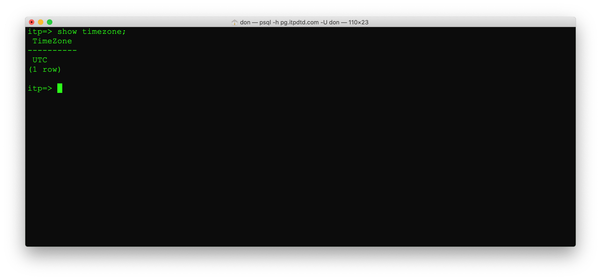

Coordinated Universal Time(UTC) is a way to store time without timezones and daylight savings. The [PostgreSQL documentation explains](https://www.postgresql.org/docs/10/datatype-datetime.html):

> For `timestamp with time zone`, the internally stored value is always in UTC (Universal Coordinated Time, traditionally known as Greenwich Mean Time, GMT). An input value that has an explicit time zone specified is converted to UTC using the appropriate offset for that time zone. If no time zone is stated in the input string, then it is assumed to be in the time zone indicated by the system's TimeZone parameter, and is converted to UTC using the offset for the timezone zone.

Fortunately we can tell `psql` what what time zone we are in and it will convert dates for us. This only effects how the data is *displayed*, not how it's stored.

    set timezone='EST';
    show timezone;

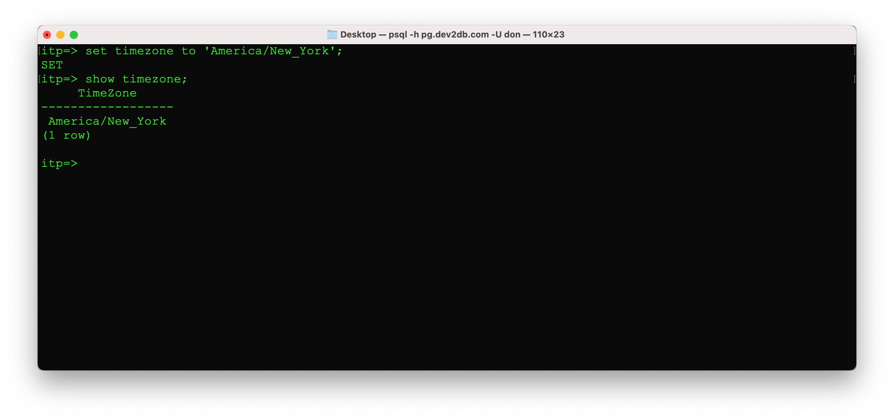

 * [Coordinated Universal Time](https://en.wikipedia.org/wiki/Coordinated_Universal_Time)
 * [Unix time](https://en.wikipedia.org/wiki/Unix_time)
 * [Every Time Zone](https://everytimezone.com)
 * [PostgreSQL Data Types: Date, Timestamp, and Time Zones](https://tapoueh.org/blog/2018/04/postgresql-data-types-date-timestamp-and-time-zones/)

OK, back to querying. Now that we set the timezone in our client, dates are converted to EST before they are shown to us. Notice the `-05` at the end of the timestamp `2019-02-08 15:35:22.474-05`. We're seeing different dates in our result set because the dates in the BETWEEN clause are also treated as EST.

    SELECT * FROM sensor_data 
        WHERE recorded_at BETWEEN '2020-02-14' AND '2020-02-15';

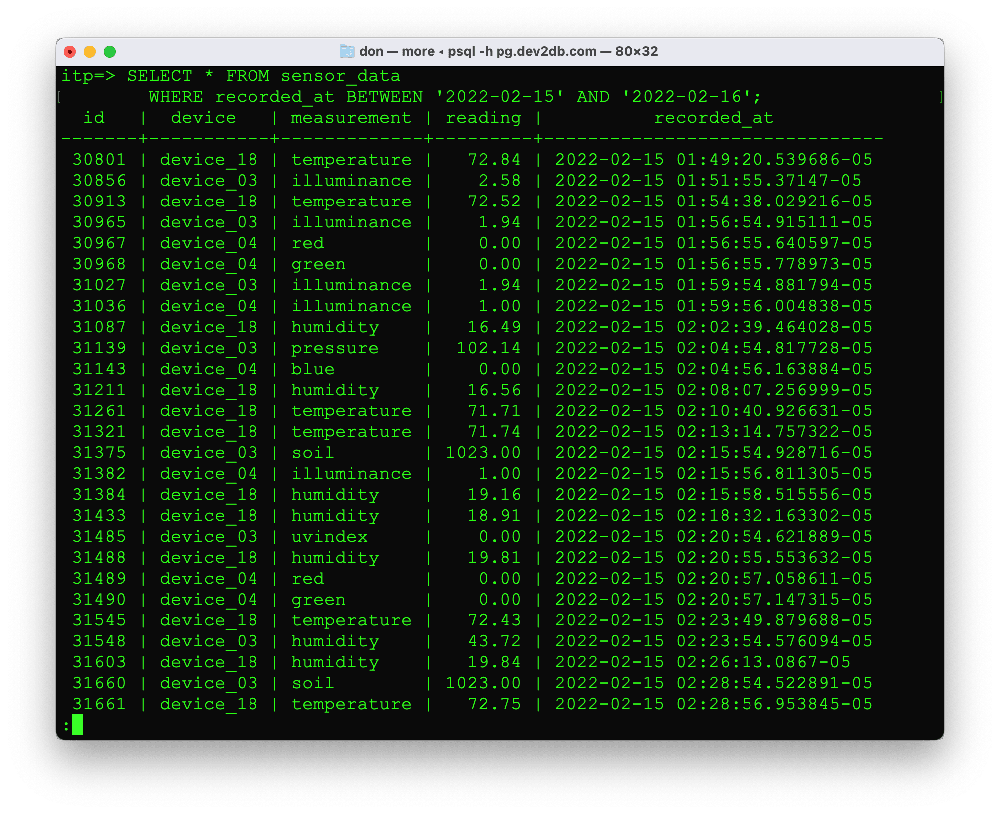

The database stores dates in UTC. Dates can be converted to a local timezone before being displayed to the user. Always include a timezone component in your timestamps so the conversion happens correctly.

See [postgres2.md](postgres2.md) for more queries you can run against an additional dataset.

&copy; 2019 Don Coleman
