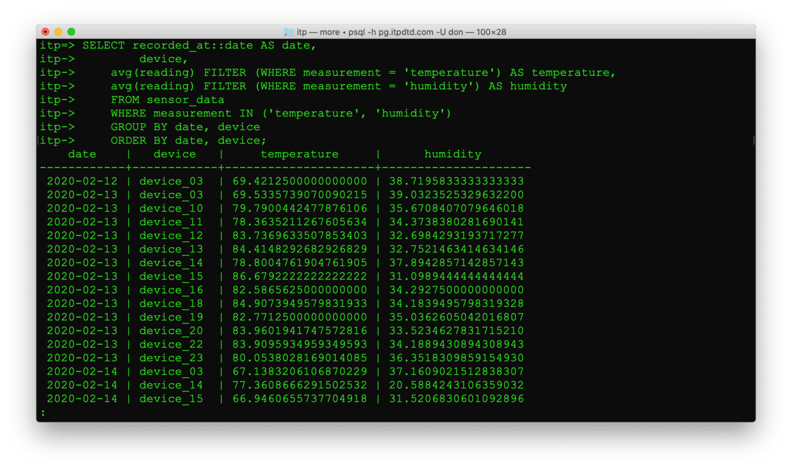
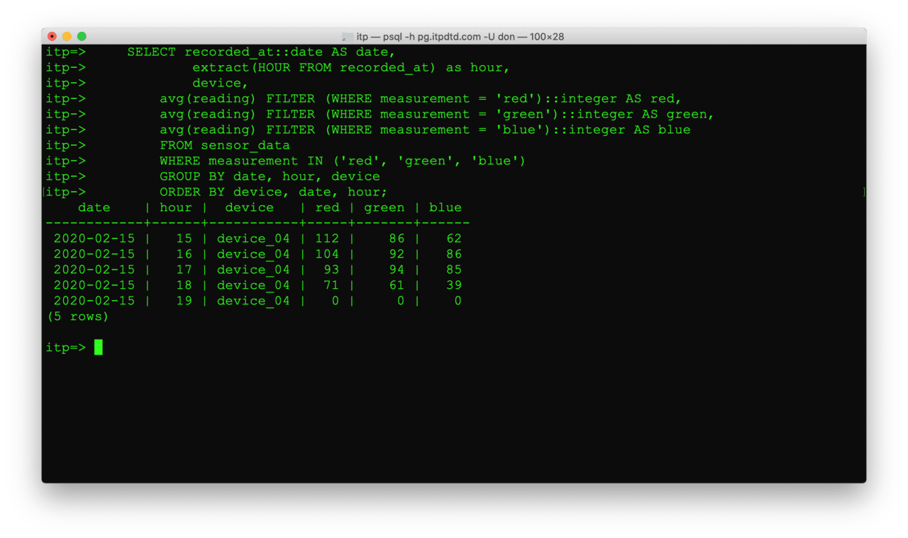
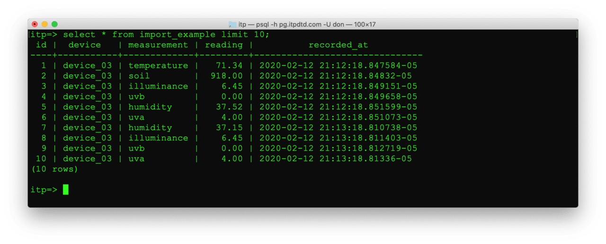

Addition SQL examples using the `itp` database

    psql -h pg.itpdtd.com -U xx
    \c itp
    set timezone TO 'America/New_York';

Use `interval` to get data within a time frame. Select records that arrived in the last 30 seconds

    select * from sensor_data where recorded_at > now() - interval '30 seconds';

You can use `filter` to create new columns when aggregating data. 

    SELECT recorded_at::date AS date, 
            device,
        avg(reading) FILTER (WHERE measurement = 'temperature') AS temperature,
        avg(reading) FILTER (WHERE measurement = 'humidity') AS humidity
        FROM sensor_data
        WHERE measurement IN ('temperature', 'humidity')
        GROUP BY date, device
        ORDER BY date, device;

Using filter to combine average red, green, and blue readings into one row.

    SELECT recorded_at::date AS date, 
            extract(HOUR FROM recorded_at) as hour,
            device,
        avg(reading) FILTER (WHERE measurement = 'red')::integer AS red,
        avg(reading) FILTER (WHERE measurement = 'green')::integer AS green,
        avg(reading) FILTER (WHERE measurement = 'blue')::integer AS blue
        FROM sensor_data
        WHERE measurement IN ('red', 'green', 'blue')
        GROUP BY date, hour, device
        ORDER BY device, date, hour;

If sensor reading arrive around the same time, you can create a query to combined the multiple readings into one row. 

    -- Put red, green, blue all on the same row for a device
    -- this assumes the readings all arrived within the same second
    SELECT r.device, r.reading AS red, g.reading AS green, b.reading AS blue, date_trunc('second', r.recorded_at) as recorded_at
        FROM sensor_data r, sensor_data g, sensor_data b
        WHERE r.measurement = 'red'
        AND g.measurement = 'green'
        AND b.measurement = 'blue'
        AND r.device = g.device
        AND r.device = b.device
        AND date_trunc('second', r.recorded_at) = date_trunc('second', g.recorded_at)
        AND date_trunc('second', r.recorded_at) = date_trunc('second', b.recorded_at);

## Exporting to CSV

psql can export data to a CSV file on your machine using `\copy`.

    \copy sensor_data to '/tmp/sensor_data.csv' DELIMITER ',' CSV HEADER;

You can also export the results of a query instead of the whole table.

    \copy (select * from sensor_data where device='device_04') to '/tmp/device_04.csv' DELIMITER ',' CSV HEADER;

## Create temporary tables

You can use the results of a query to create a temporary table. Temporary tables are deleted when you disconnect.

    SELECT * 
        INTO TEMPORARY TABLE device_04 
        FROM sensor_data 
        WHERE device = 'device_04';

## Importing from CSV

Create an empty temporary table for importing data. They query uses the definition of sensor_data to define the columns while the limit 0 keeps the table empty.

    select * into temporary table import_example from sensor_data limit 0;

Import CSV - psql can import data to a CSV file on you machine.
    
    \copy import_example from '/tmp/sensor_data.csv' DELIMITER ',' CSV HEADER;

After importing, select to see the data. Since this it a temporary table it will be deleted when you disconnect.
    
    select * from import_example limit 10;

