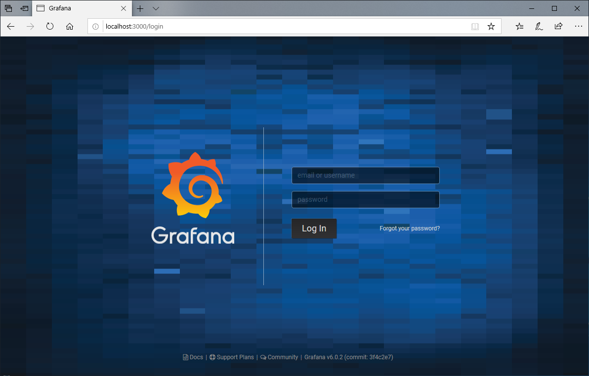
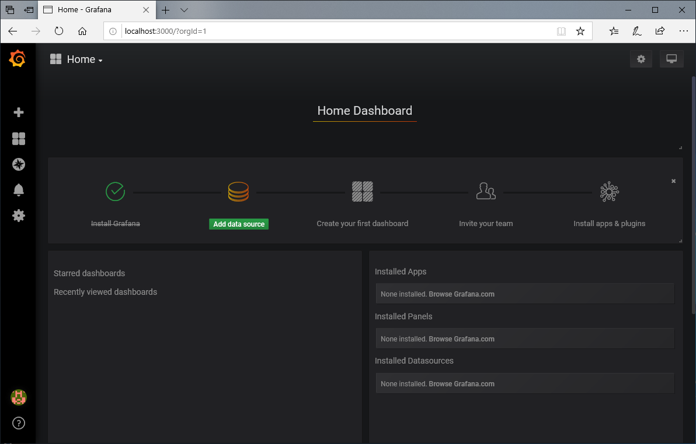
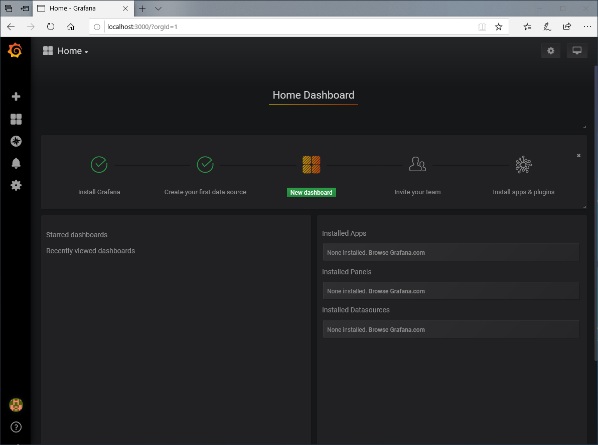
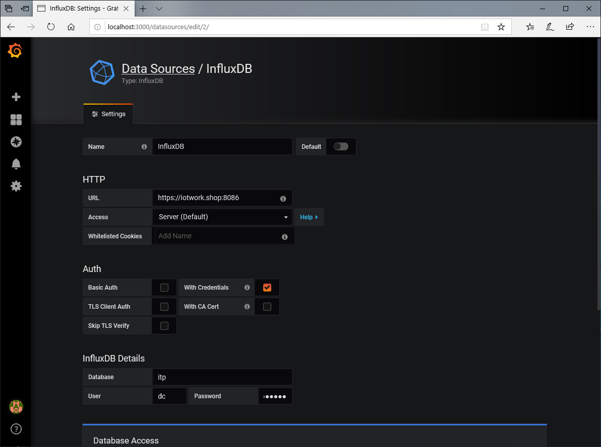
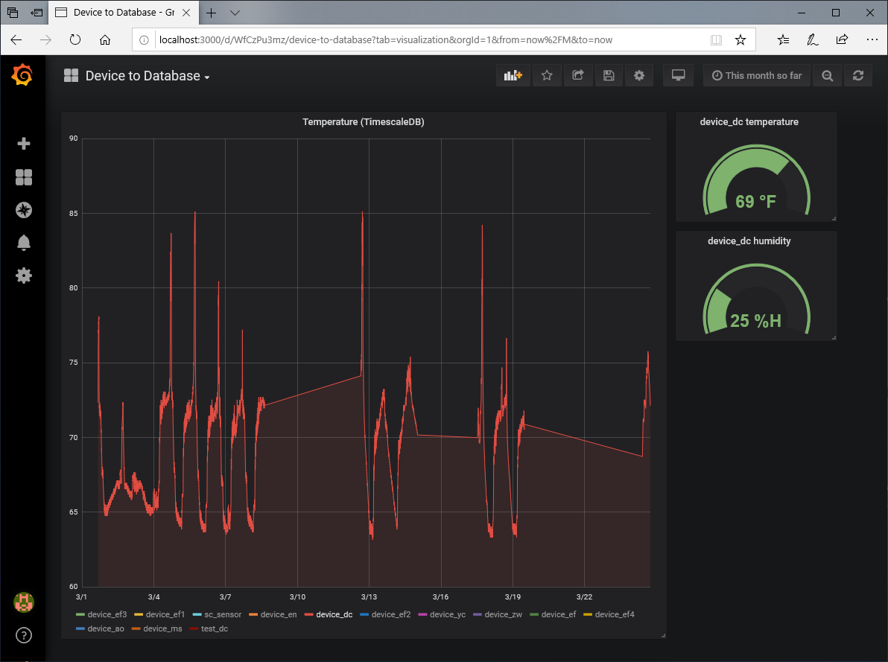

# Grafana

Install [grafana](https://grafana.com) using brew on macOS

    brew install grafana

Start the service with 

    brew services start grafana

Shut the service down when you're done with 

    brew services stop grafana

See https://grafana.com/grafana/download for other platforms

Once the server has started, open a web browser to http://localhost:3000

Log into Grafana using admin/admin. You will be prompted to set up a new password.

Home dashboard. Choose `Add data source`.

We are going to add a TimescaleDB DB connection so select PostgreSQL.

Add the configuration information for TimescaleDB. Be sure to enable the switch for TimescaleDB under PostgreSQL details.

From the home dashboard choose `New dashboard`.

On the new dashboard. Click the `Add Query` button.

Use the UI to create a query for temperature grouped by device.

Use the arrow on the top left to navigate back to the dashboard.

Add an InfluxDB data source.

Add some gauges using the queries from InfluxDB. Change the time range to be `This month so far`. 

Increasing the time range shows many more devices. The graph can get very confusing. Click on one device in the legend to hide the other series.

