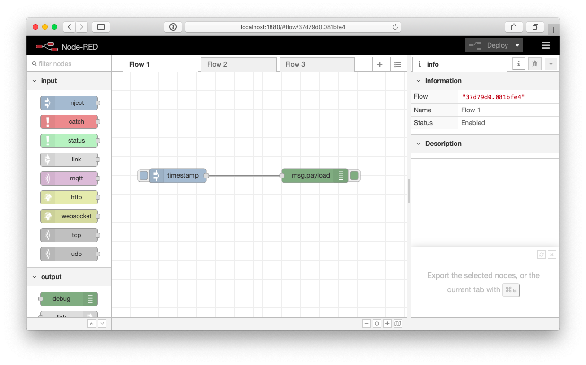
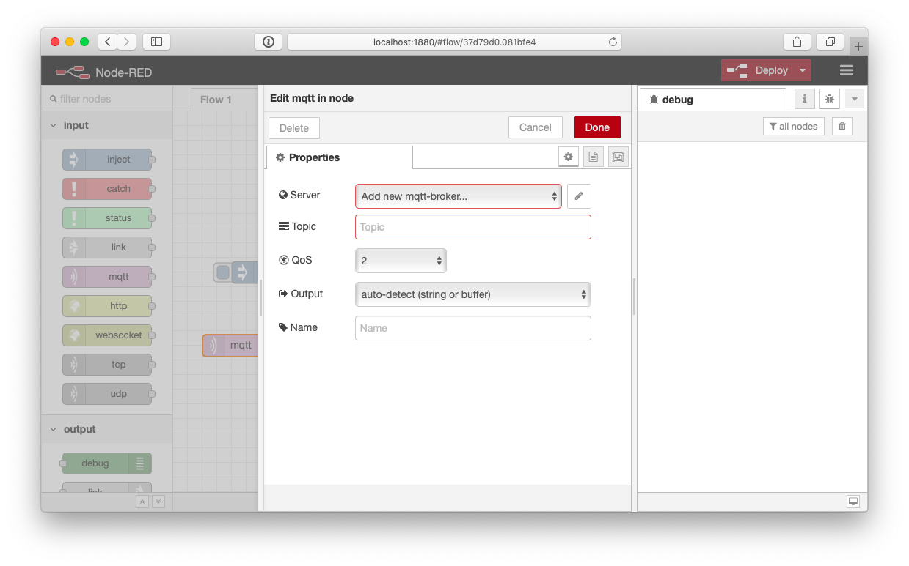
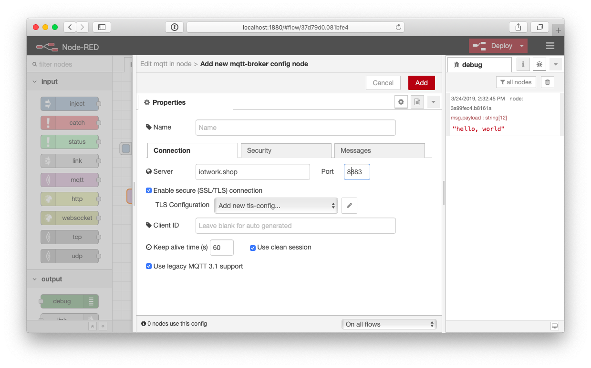
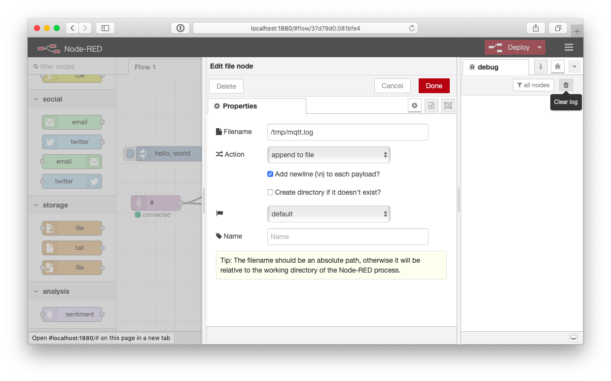
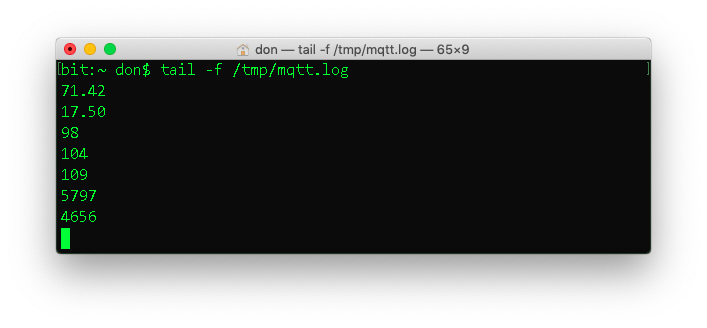
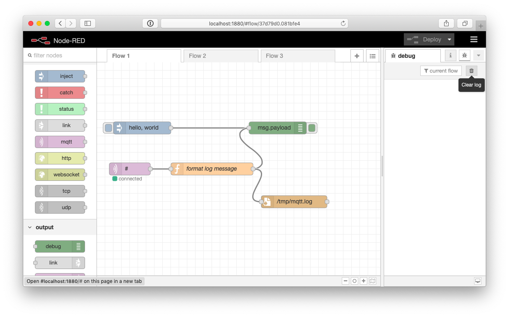
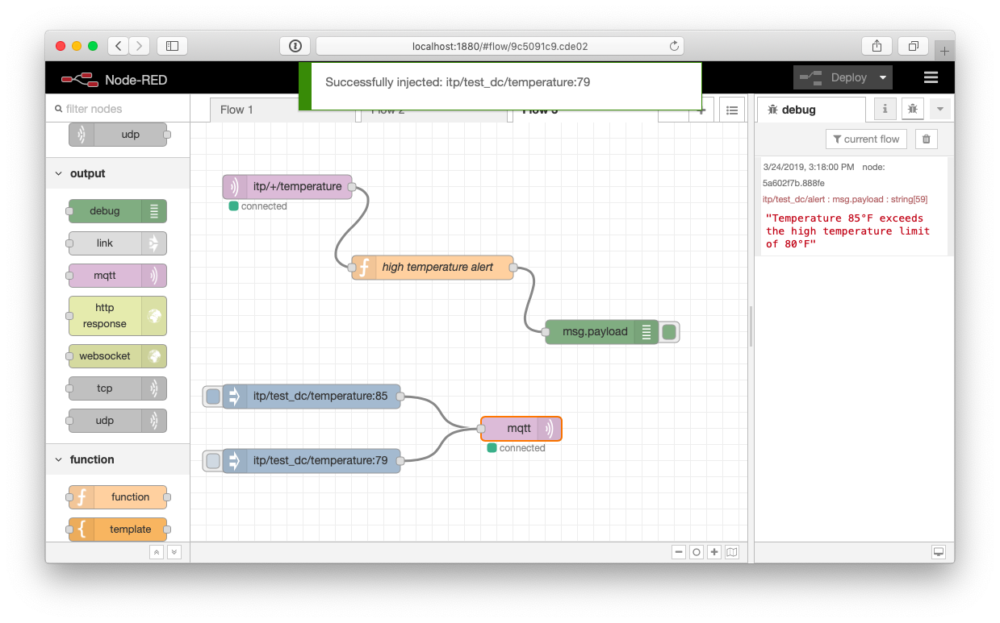
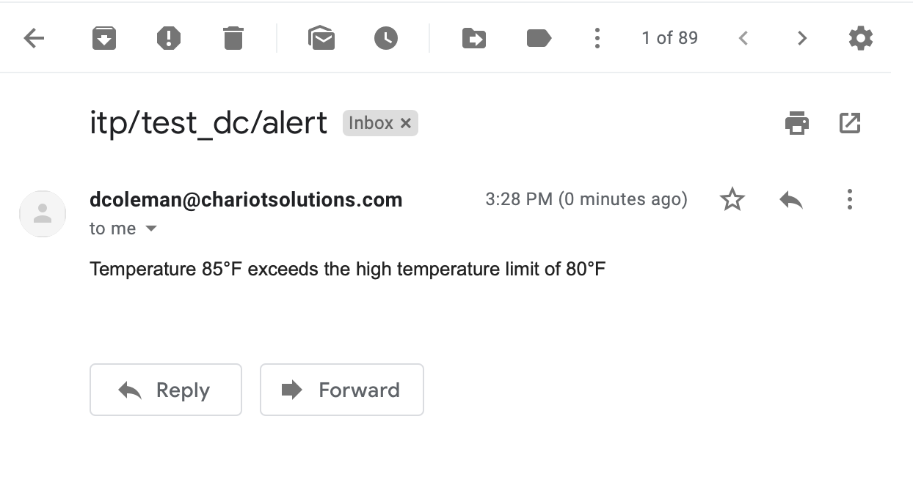

# Node-RED

## Getting Started

### Installing

Install Node-RED using npm

    sudo npm install -g --unsafe-perm node-red

For more details see https://nodered.org/docs/getting-started/installation

### Running

Start node-red from the command line

    node-red

Open a web browser to http://localhost:1880

## Flows

### Hello World
    
Drag an inject node from the left side onto the flow. Drag a debug node onto the flow. Draw a line to connect inject to debug. Double click on inject node to configure it. Change payload from timestamp to string. Type "hello, world" in the payload field. Deploy the flow using the button on the top right. Switch the debug tab in the right pane. Click the handle on the left side of the inject node. You should see a debug message that says hello, world.

### MQTT

Drag an MQTT input node from the left side onto the workflow. Draw a line to connect the MQTT node to the debug node.

Double click on the MQTT node to configure it. Click the edit button next to the server field to configure a new MQTT connection.

Enter iotwork.shop port 8883 for the connection. Check the "enable secure" checkbox. Use the security tab to enter your credentials. Click the add button.

Enter `#` for the topic and click Done.

Deploy the workflow. You should see MQTT messages in the debug window.

### Logging Messages

Drag a *file output* node onto the flow. Connect the output of MQTT to the input of the file. Double click on the file node to configure it. Enter /tmp/mqtt.log as the filename. Click done and deploy the workflow.

Check the contents of the log file. Open a terminal. `tail -f /tmp/mqtt.log`. The file contains data, but only the payload. We really want to log a timestamp, the topic and the payload [like we did in week 5](https://github.com/don/ITP-DeviceToDatabase/blob/master/05_Process_and_Graph_Data/processing.md#log-mqtt-messages-to-a-file).

Drag a function node onto the flow. Double click to configure. Name the node "format log message". Enter the flowing code for the function.

    const timestamp = new Date().getTime();
    // tab separated values to be logged
    const data = `${timestamp}\t${msg.topic}\t${msg.payload}`;
    // replace the current payload with our new data
    msg.payload = data;
    return msg;

Click done. Delete the connections coming out of the MQTT node. Connect the output of the MQTT node to the function node. Connect the output of the function node to the debug node and the file node. Deploy the workflow. Check the log file again using tail.

### Writing to MQTT

Create a new workflow. Drag 2 inject nodes onto the flow. Drag an MQTT output node onto the flow. Connect the inject nodes to the MQTT node. Configure one inject node to send "ON" and the other to send "OFF". Double click the MQTT node. Choose the correct server. Enter `itp/device_xx/led` for the topic. Click done and deploy the flow. Click the on and off nodes to control the LED on your device.

### High Temperature Alert

Create a new flow. Drag a MQTT input onto the flow. Configure it for the topic `itp/+/temperature`. Drag a function node onto the flow. Name the node "high temperature alert" and enter the following code.

    const temperature = Number(msg.payload);
    if (temperature > 80) {
        const alertMessage = `Temperature ${temperature}°F exceeds the high temperature limit of 80°F`

        // get the device id and create a new topic
        const device = msg.topic.split('/')[1];
        msg.topic = `itp/${device}/alert`;
        msg.payload = alertMessage;
        return msg;
    } else {
        return null;
    }

Drag a debug node onto the workflow. Wire the MQTT output to the function and the function output to the log.

Drag 2 inject nodes onto the flow. Drag an MQTT output node onto the flow. Wire the inject nodes to MQTT. Configure one inject node to send 85 to `itp/test_xx/temperature`. Configure the other inject node to send a value of less than 80 to the same topic. Configure the server for the MQTT node. Leave the topic blank. Deploy the node. Change debug from `all nodes` to `current flow`. Deploy the flow.  Use the inject nodes to test the flow. Make sure the alert only fires when temperature is greater than 80.

Rather than logging the alert, you can send and email or post a message to twitter. Drag an email node onto the flow. Wire the output the high temperature alert to the email node. Click email to configure. I used my gmail account for SMTP. Since I used 2 factor authentication, I needed to [create an application specific password](https://support.google.com/accounts/answer/185833?hl=en).

## Additional Info

You can [export workflows](https://nodered.org/docs/user-guide/editor/workspace/import-export) to JSON. Use the [Palette Manager](https://nodered.org/docs/user-guide/editor/palette/manager) to install extensions for Node-RED.

See the Node-RED docs for more details

 * [Node-RED User's Guide](https://nodered.org/docs/user-guide/)
 * [Node-RED Cookbook](https://cookbook.nodered.org/mqtt/)
 * [Node-RED Extensions](https://flows.nodered.org)
 

