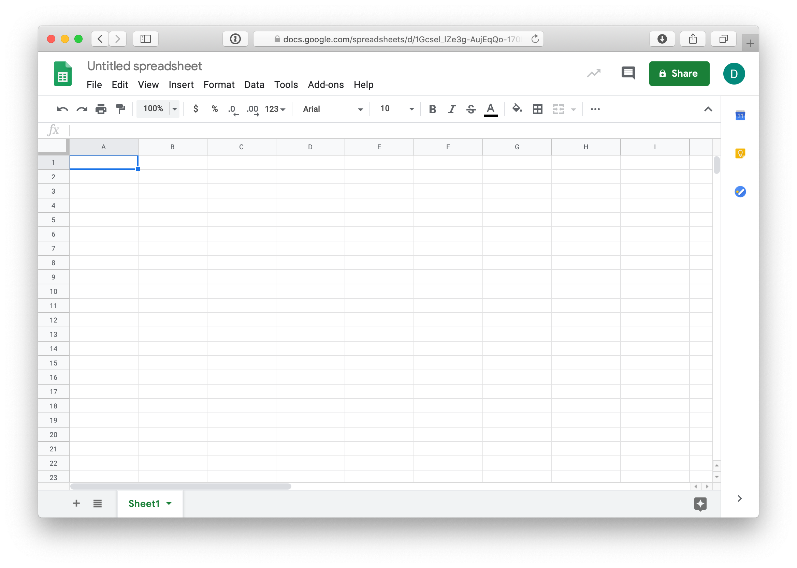
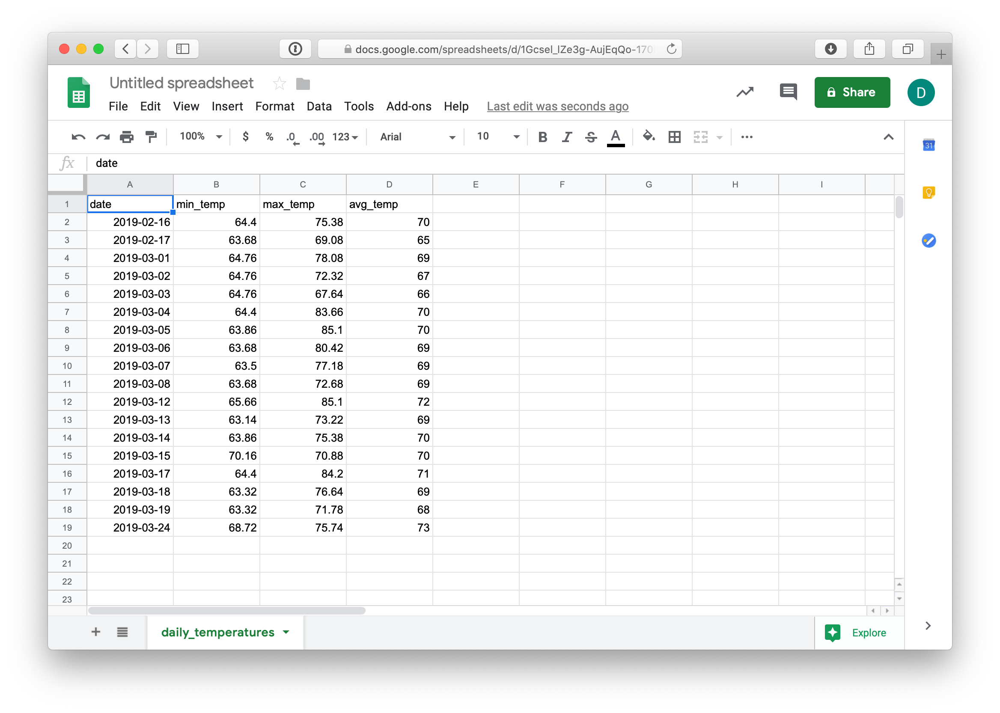
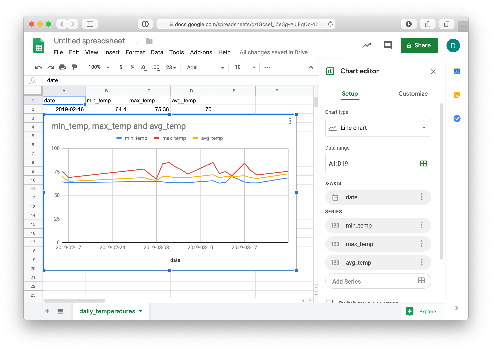
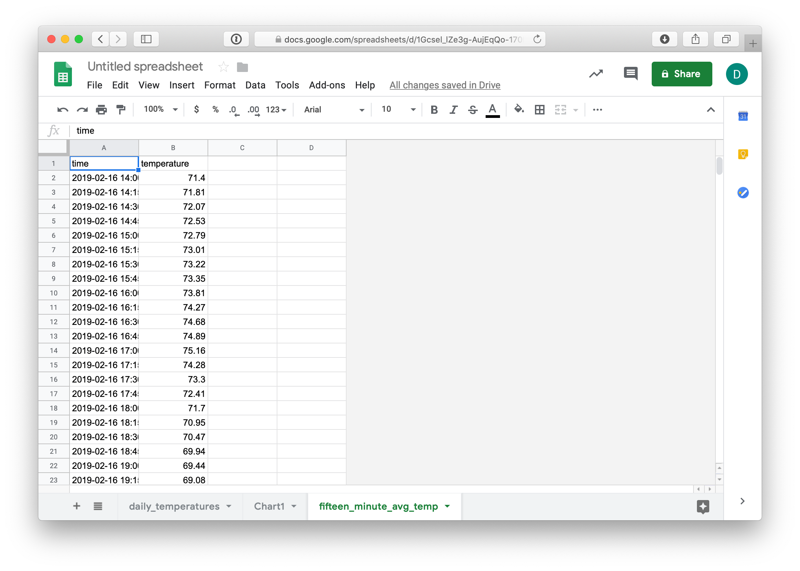
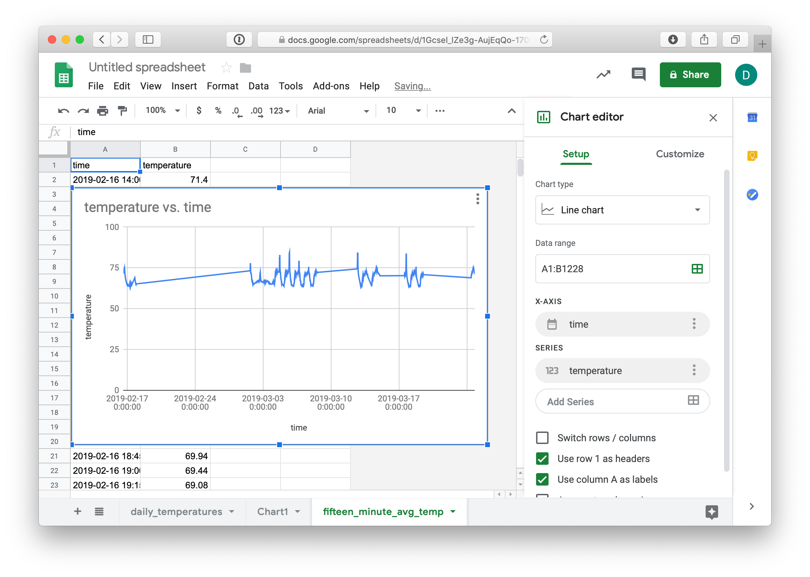
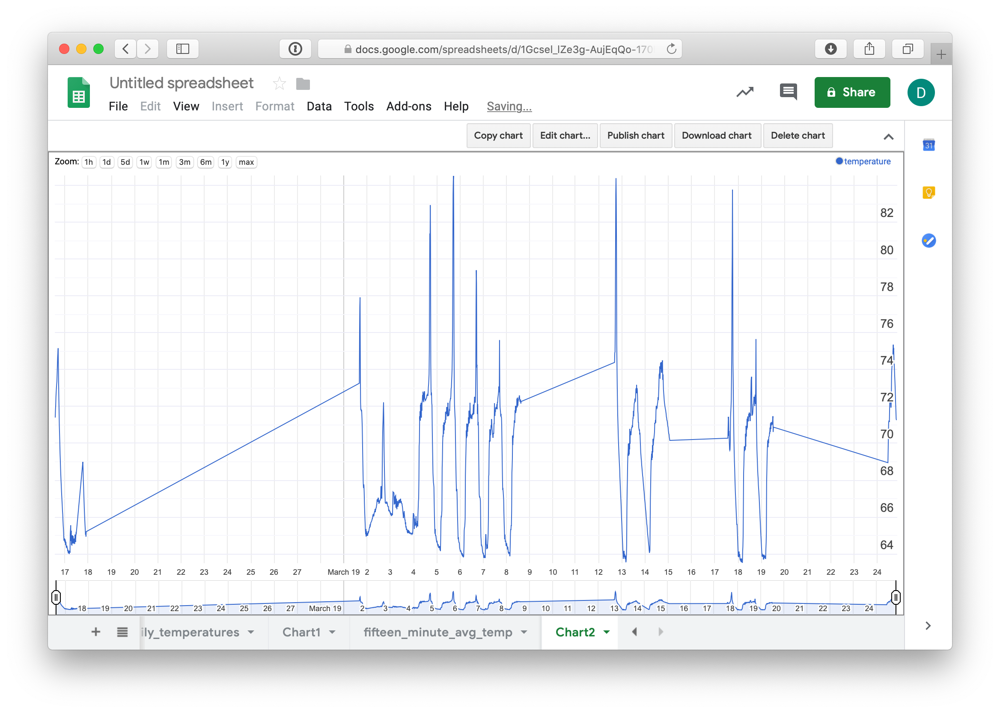

# Google Sheets 

Use Google spreadsheets to graph data.

### TimescaleDB

Connect to TimescaleDB

    psql -h timescale.iotwork.shop -U xx itp

Set the timezone

    set timezone="America/New_York";

### Daily Min, Max, and Average Temperatures

Run a query and export min, max, and average daily temperature for device_dc as a CSV file.

    \copy (select time_bucket('1 day', recorded_at::timestamp)::date as date, min(reading) as min_temp, max(reading) as max_temp, round(avg(reading)) as avg_temp from sensor_data where measurement = 'temperature' and device = 'device_dc' group by date order by date) to '/tmp/daily_temperatures.csv' WITH (format csv, header);

Create a Google spreadsheet https://sheets.google.com

Import data using `File -> Import -> Upload`

Insert a chart using `Insert -> Chart`

Move the chart to it's own page. Click top right corner of chart. On the menu choose "Move to own chart".

## Average Temperature using 15 Minute Buckets

Run a 2nd query, exporting average temperature using 15 minute time buckets.

    \COPY ( SELECT time_bucket('15 minutes', recorded_at::timestamp) AS time, round(avg(reading)::numeric, 2) as temperature FROM sensor_data WHERE measurement = 'temperature' AND device = 'device_dc' GROUP BY time ORDER BY time) to '/tmp/fifteen_minute_avg_temp.csv' WITH (format csv, header true)

Import data using `File -> Import -> Upload`. Be sure to select "create new sheet".

Insert a chart using `Insert -> Chart`

Change the Chart Type to Timeline chart (near bottom)

Move the chart to a new sheet

