# Grafana

## Install

### macOS 

Install [grafana](https://grafana.com) using brew on macOS

    brew install grafana

Start the service with 

    brew services start grafana

Shut the service down when you're done with 

    brew services stop grafana

### Windows

Download the Windows installer from https://grafana.com/grafana/download?platform=windows&edition=oss. I used the OSS version. The Enterprise version will work too. Run the installer and follow the prompts.

### Cloud

If you'd rather not install Grafana, you can try and create a cloud account at https://grafana.com/products/cloud/

## Login

Once the server has started, open a web browser to http://localhost:3000

Log into Grafana using admin/admin. You will be prompted to set up a new password.

Home dashboard. Choose `Add data source`.

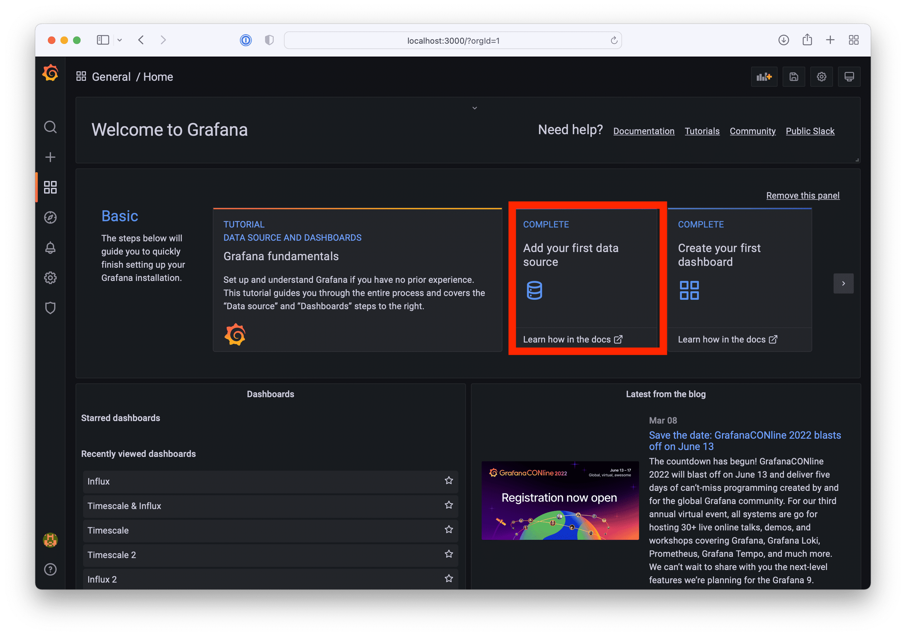

## TimescaleDB 

We are going to add a TimescaleDB DB connection so select PostgreSQL.

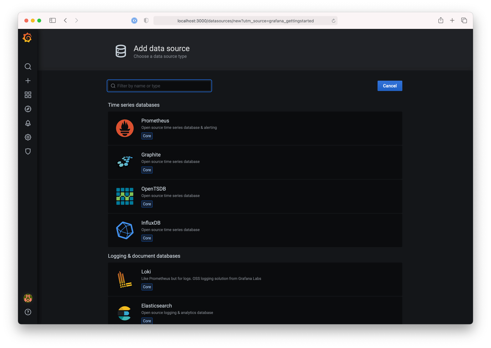

Add the configuration information for TimescaleDB. 

 * Host: timescale.dev2db.com:5432
 * Database: tsitp
 * Use your username and password
 * Change SSL mode to require
 * Under PostgreSQL details
    * Change version to 12+
    * Enable the switch for TimescaleDB 

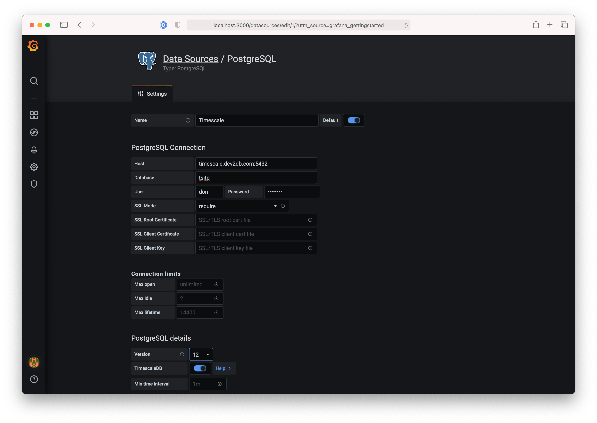

Click Save & Test

From the home screen choose `Create your first dashboard`.

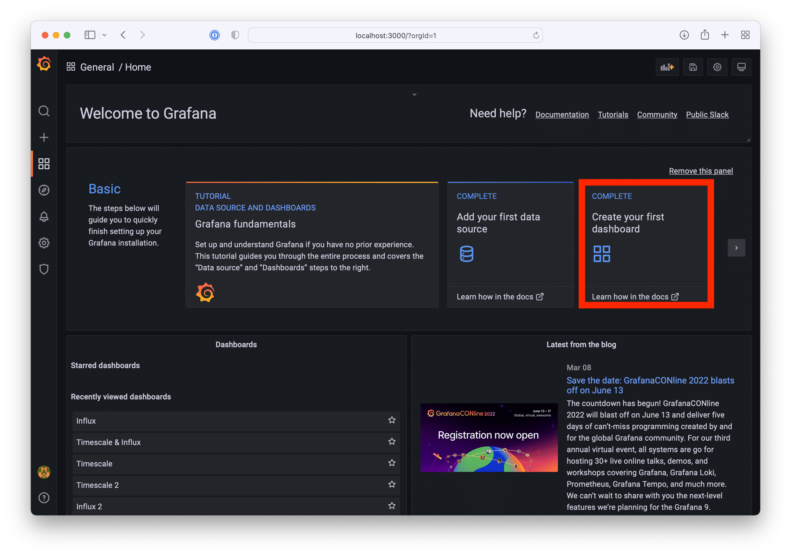

Push the `Add new panel` button

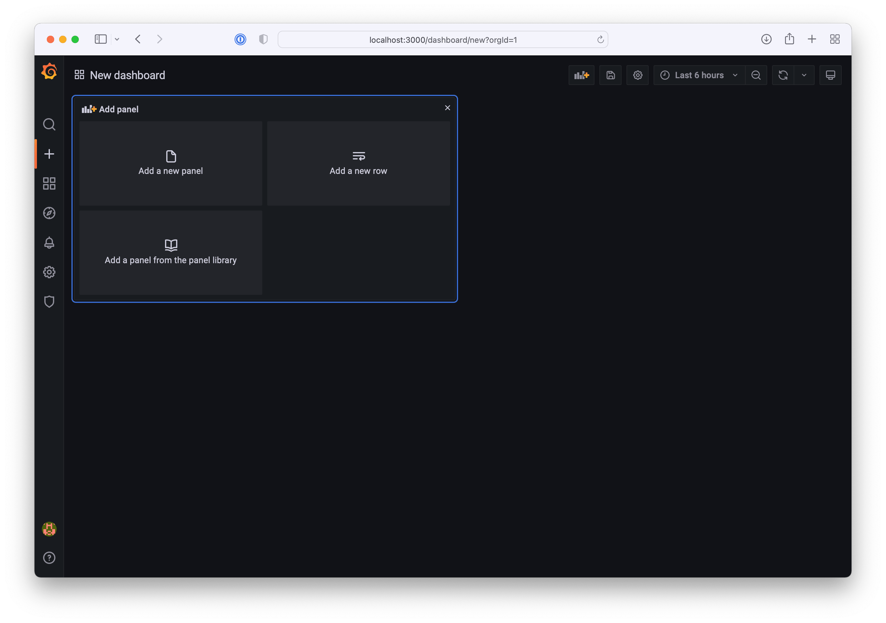

Use the UI to edit the query to show temperature grouped by device. Your query should match the screenshot below.

Use the Query Inspector button to see more details about how Grafana is getting data from Timescale.

Use the arrow on the top left to navigate back to the dashboard.

Click the `Add Panel` button near the top, and push the blue `Add new Panel` button.

Expand the visualization section on the right to switch from a bar graph to a gauge. Edit the graphical query editor so it matches the screenshot above. Hit apply to save. Resize the charts so they fit nicely on the page.

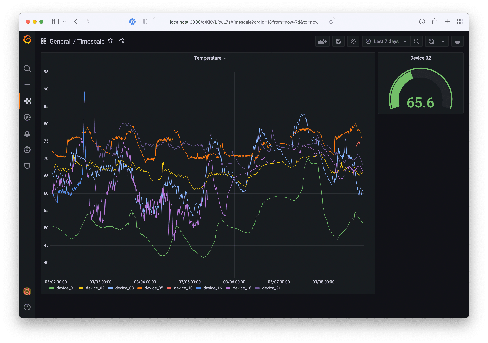

## InfluxDB

Add another database source for InfluxDB. From the left side toolbar, choose Setting -> Data Sources -> Add Data Source. Choose InfluxDB.

HTTP
* URL https://influx.dev2db.com:8086
 
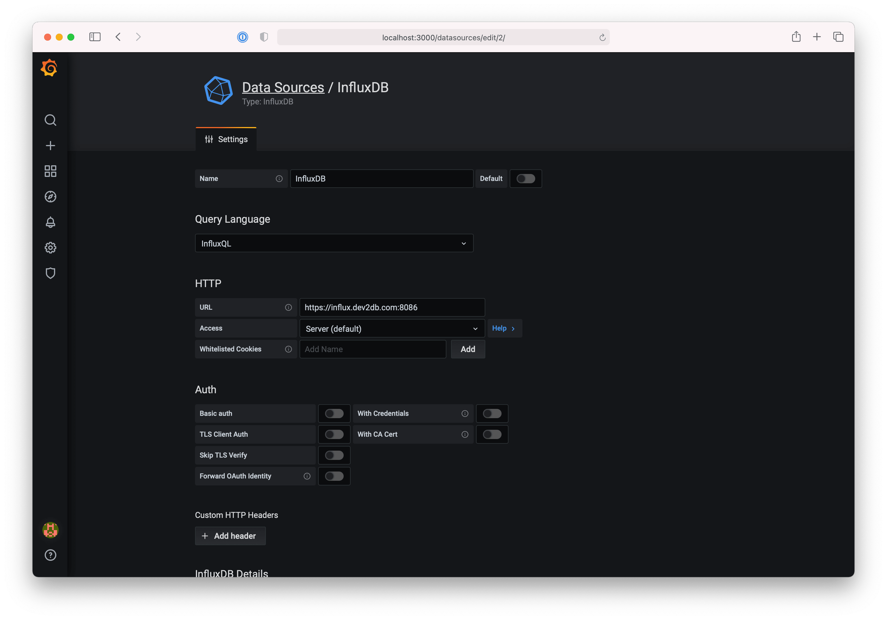

InfluxDB Details
* Database: itp
* Enter your username and password
 

Add another panel to your dashboard and create a temperature query using InfluxDB as a data source. The `time($_interval)` the GROUP BY section buckets the data into the interval specified in the datasource, 10 seconds. Experiment with a larger interval like `time(5m)` or `time(4h)` to see how it changes your graph.

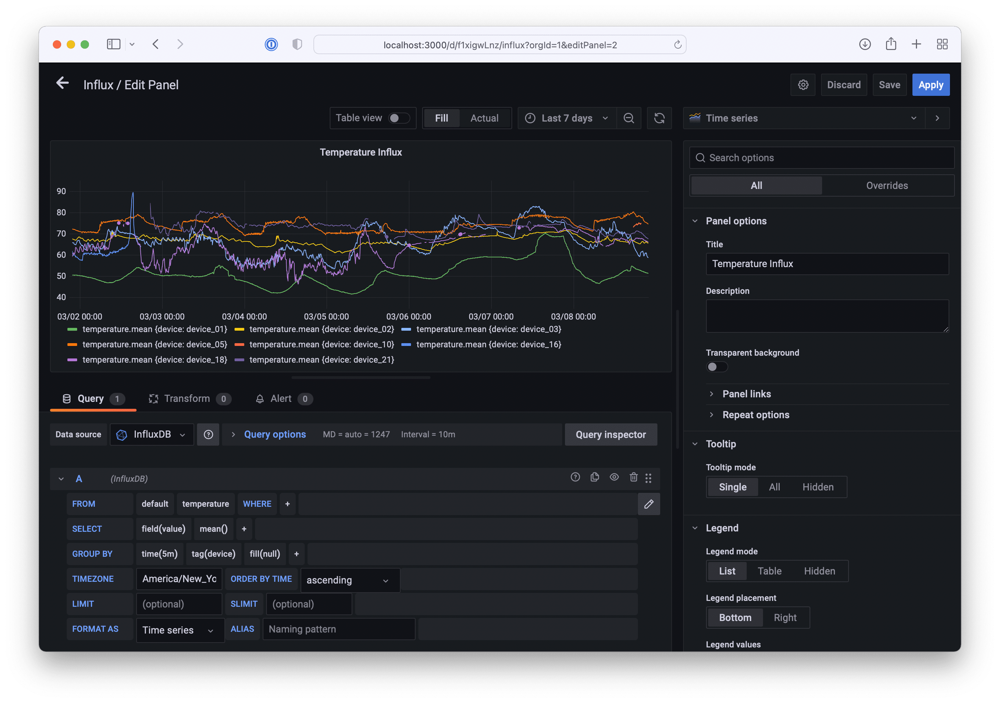

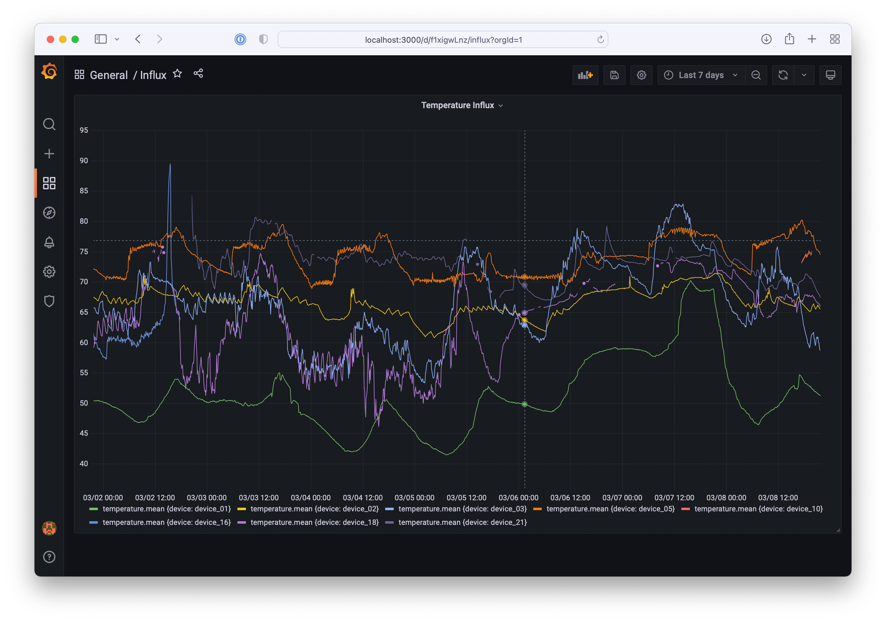

Sometimes there is too much data in a chart to clearly see what's happening. Clicking on a label in the legend will display only that series.

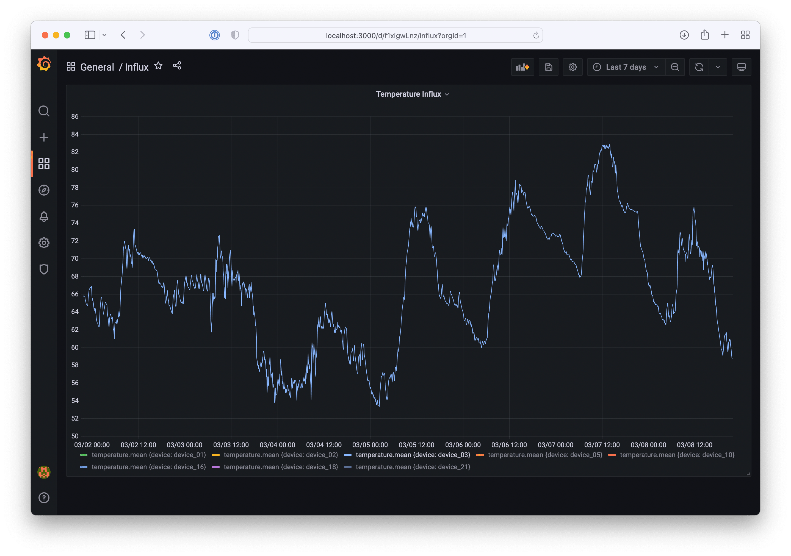

The dashboard can mix queries from multiple data sources.

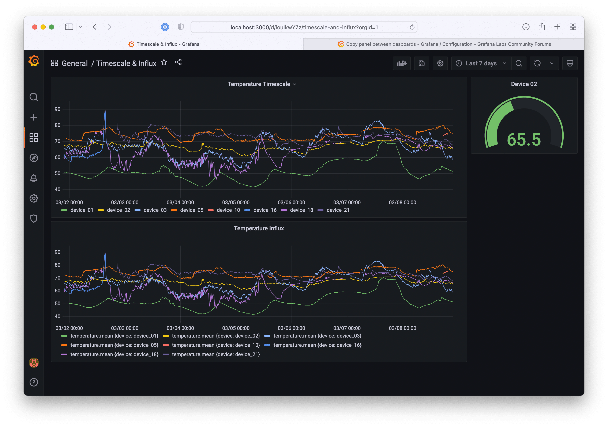

Use the time selection drop down on the top right to choose different time frames, such as `Last 2 days` or  `This month so far`. 

Now create some additional dashboards and queries for your data.

## Cleanup

### macOS

    brew services stop grafana

### Windows

The Grafana installer installed a Windows service to start Grafana whenever you boot your computer. You probably don't want that. In the Windows search box, type "service" and open the Services app. Scroll down to Grafana. Right click and select Properties. Change the startup type from Automatic to Manual.

Now that the service is set to manual, you'll need to start Grafana from the Services app when you reboot your computer.

Alternately you can use an Administrator cmd prompt to start and stop the Grafana service

    sc start Grafana

    sc stop Grafana