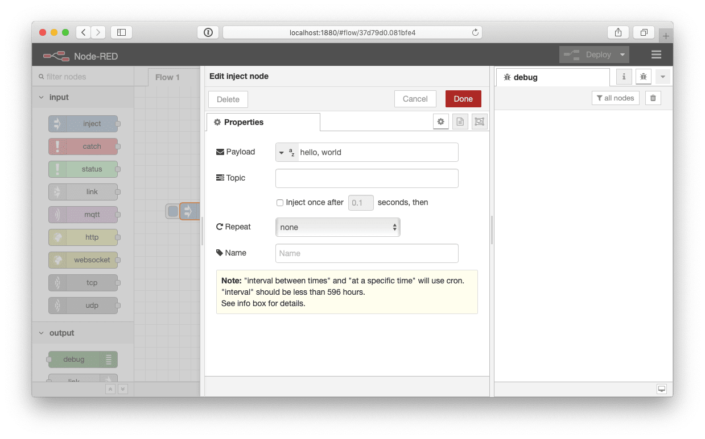
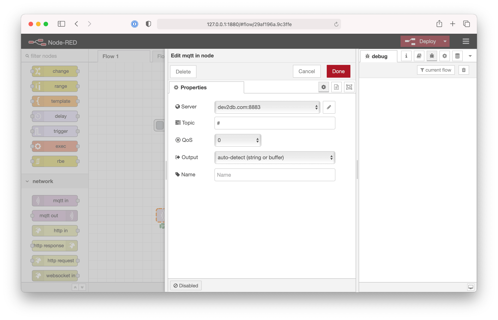
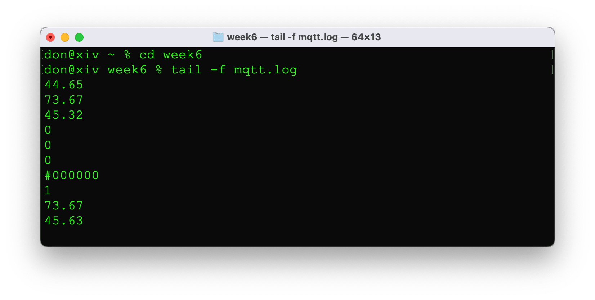
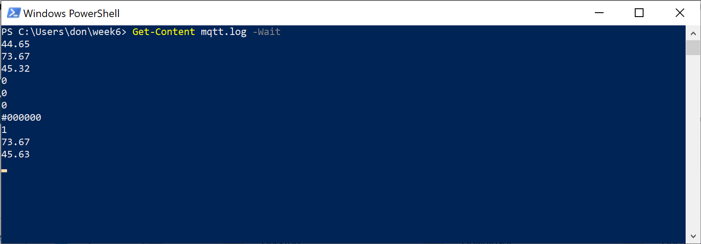
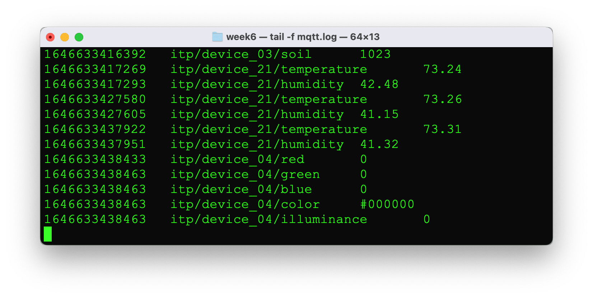
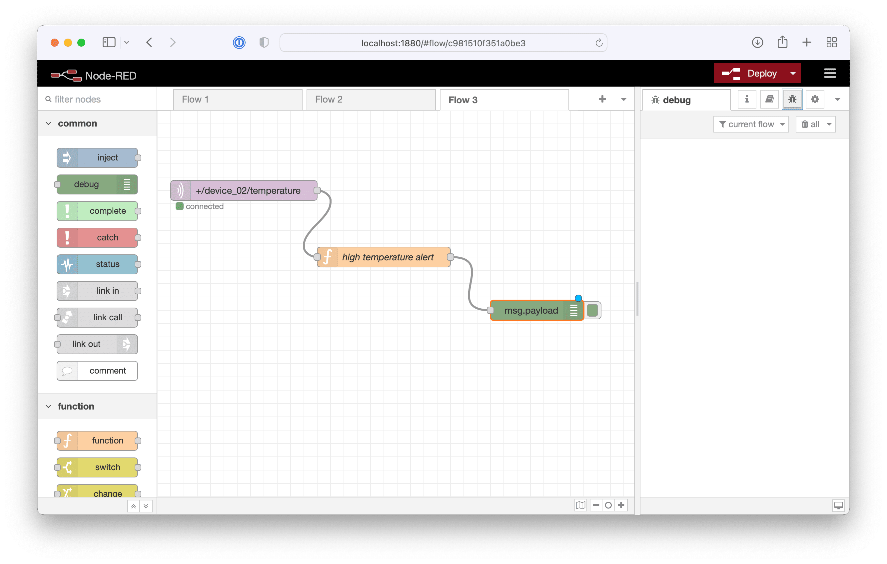
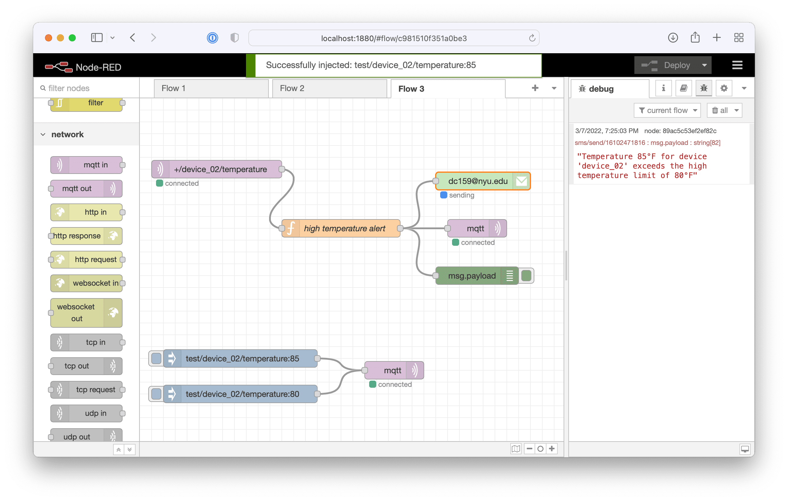

# Node-RED

## Getting Started

### Installing

Open `Terminal.app` or `cmd.exe` and create a new directory.

    mkdir week6
    cd week6

Install Node-RED using npm

    sudo npm install -g --unsafe-perm node-red

For more details see https://nodered.org/docs/getting-started/installation

### Running

Start node-red from the command line

    node-red

Open a web browser to http://localhost:1880

## Flows

### Hello World
    
Drag an `inject` node from the left side onto the flow. Drag a `debug` node onto the flow. Draw a line to connect inject to debug. Double click on inject node to configure it. Change payload from timestamp to string. Type "hello, world" in the payload field. Deploy the flow using the button on the top right. Switch the debug tab in the right pane. Click the handle on the left side of the inject node. You should see a debug message that says hello, world.

### MQTT

Drag a `mqtt in` node from the left side onto the workflow. Draw a line to connect the MQTT node to the debug node.

Double click on the MQTT node to configure it. Click the edit button next to the server field to configure a new MQTT connection.

Enter dev2db.com port 8883 for the connection. Check the "enable secure" checkbox. Use the security tab to enter your credentials. Click the add button.

Enter `#` for the topic and click Done.

Wire the MQTT node to the Debug node. Deploy the workflow. You should see MQTT messages in the debug window.

### Logging Messages

Drag a `file` node onto the flow. Connect the output of `mqtt` node to the input of the file. Double click on the file node to configure it. Enter mqtt.log the filename. Click done and deploy the workflow.

Open a 2nd terminal and tail the MQTT log to ensure data is being written correctly.

macOS

    cd week6
    tail -f mqtt.log

Windows users should use PowerShell

    cd week6
    Get-Content mqtt.log -Wait

The file contains data, but only the payload. We really want to log a timestamp, the topic, and the payload [like we did in when writing code to process MQTT messages.](../05_Code/processing-mqtt-data.md#log-mqtt-messages-to-a-file).

Drag a `function` node onto the flow. Double click to configure. Name the node "format log message". Enter the flowing code for the function.

    const timestamp = new Date().getTime();
    // tab separated values to be logged
    const data = `${timestamp}\t${msg.topic}\t${msg.payload}`;
    // replace the current payload with our new data
    msg.payload = data;
    return msg;

Click done. Delete the connections coming out of the MQTT node. Connect the output of the MQTT node to the function node. Connect the output of the function node to the debug node and the file node. Deploy the workflow. Check the log file again using tail.

### Writing to MQTT

Create a new workflow. Drag 2 `inject` nodes onto the flow. Drag a `mqtt out` node onto the flow. Connect the inject nodes to the MQTT node. Configure one inject node to send "ON" and the other to send "OFF". Double click the MQTT node. Choose the correct server. Enter `itp/device_xx/led` for the topic. Click done and deploy the flow. Click the on and off nodes to control the LED on your device.

### High Temperature Alert

Create a new flow. Drag a `mqtt in` onto the flow. Configure it for the topic `+/+/temperature` or `+/device_XX/temperature`. Drag a function node onto the flow. Name the node "high temperature alert" and enter the following code. Be sure to update the phone number in the code with your phone number. For testing we use the `test/` prefix so we're not mixing fake data with real data. The real data starts with `itp`. By using a `+` wilcard, you can handle test messages and real temperature messages.

    // put your phone number (including the country code) here
    const phone = '17185559999';
    const maxTemperature = 80;
    const temperature = Number(msg.payload);
    if (temperature > maxTemperature) {

        // get the device id and create a message
        const device = msg.topic.split('/')[1];
        const alertMessage = `Temperature ${temperature}°F for device '${device}' exceeds the high temperature limit of ${maxTemperature}°F`

        // publish to the sms topic to send a message
        msg.topic = `sms/send/${phone}`;
        msg.payload = alertMessage;
        return msg;
    } else {
        return null;
    }

Drag a debug node onto the workflow. Wire the MQTT output to the function and the function output to the log.

Next we'll add some nodes that send test messages. Drag two `inject` nodes onto the flow. Drag an `MQTT out` node onto the flow. Wire the inject nodes to MQTT. Configure one inject node to send 85 to `test/device_XX/temperature`. Configure the other inject node to send a value of 80  or less to the same topic. Double click on the MQTT node and choose the dev2db.com:8883 sever. Leave the topic blank. Deploy the node. Change debug pane from `all nodes` to `current flow`.  Use the inject nodes to test the flow. Make sure the alert only fires when temperature is greater than 80.

Now that the high temperature alert logic is working, you need to publish a message back to MQTT in order to send the SMS notification. Drag another `MQTT out` node onto the flow. Configure the node. Wire the high temperature alert to the MQTT out node. Deploy the workflow.

If everthing is set up correctly you should have received an SMS message. The SMS messages are sent via Twilio by code running on the server. See [Processing MQTT Data](https://github.com/don/ITP-DeviceToDatabase/blob/master/05_Code/processing-mqtt-data.md#sms) from Chapter 5 for more details of how this works.

In addition to SMS, you could also send an email notification, post to Slack, or post to Twitter. Sending email requires a plugin such as `node-red-node-email`. Open the node-red menu (top right). Choose Manage palette. Choose the install tab. Search for *email*. Install `node-red-node-email`.

Drag an email node onto the flow. Wire the output the high temperature alert to the email node. Click email to configure. I used my work gmail account for SMTP and send the email to my NYU account. Since my email uses multi-factor authentication, I needed to [create an application specific password](https://support.google.com/accounts/answer/185833?hl=en). Note that application specific password don't appear to be enabled for NYU gmail.

## Additional Info

You can [export workflows](https://nodered.org/docs/user-guide/editor/workspace/import-export) to JSON. Use the [Palette Manager](https://nodered.org/docs/user-guide/editor/palette/manager) to install extensions for Node-RED.

See the Node-RED docs for more details

 * [Node-RED User's Guide](https://nodered.org/docs/user-guide/)
 * [Node-RED Cookbook](https://cookbook.nodered.org/mqtt/)
 * [Node-RED Extensions](https://flows.nodered.org)
 