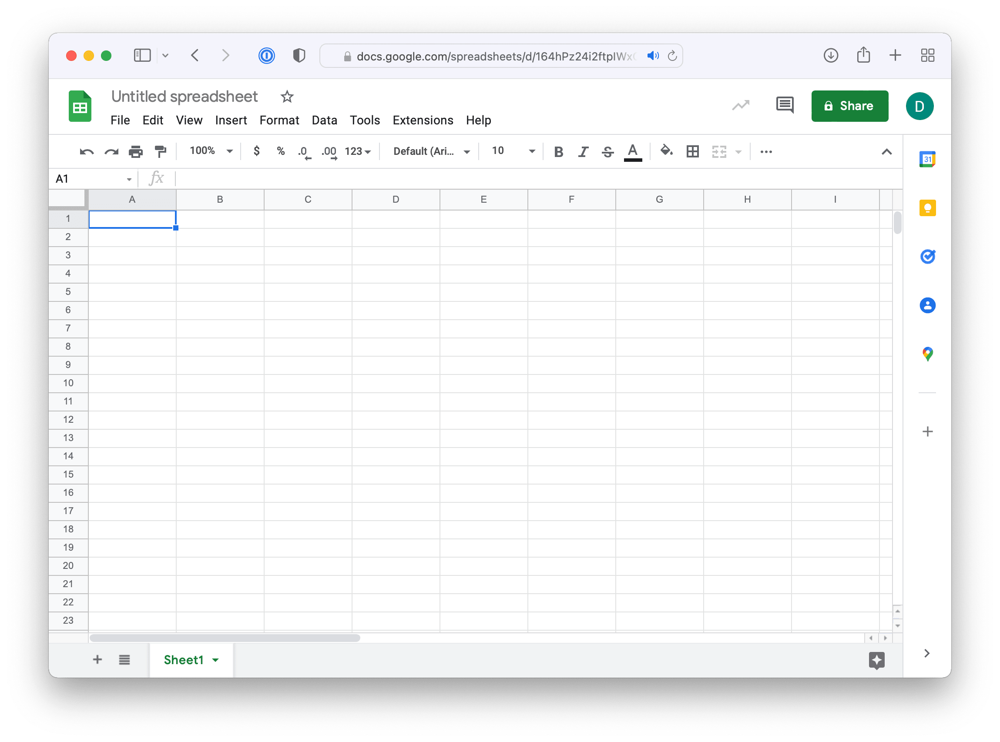
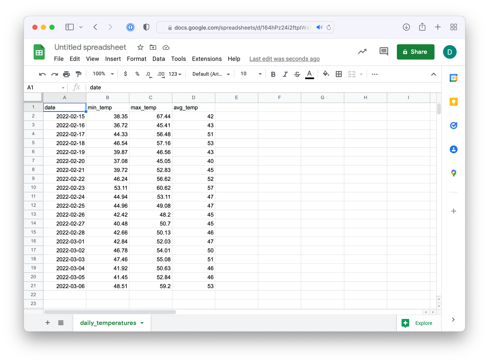
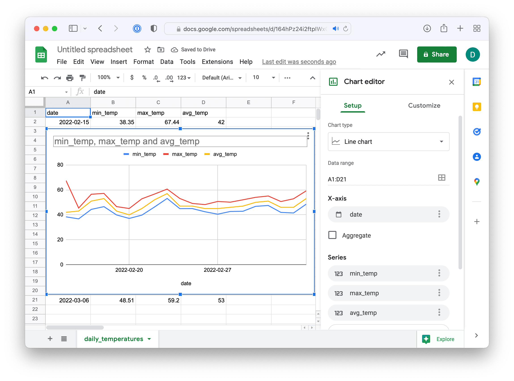
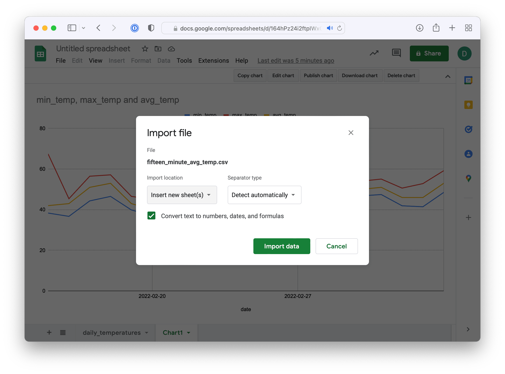
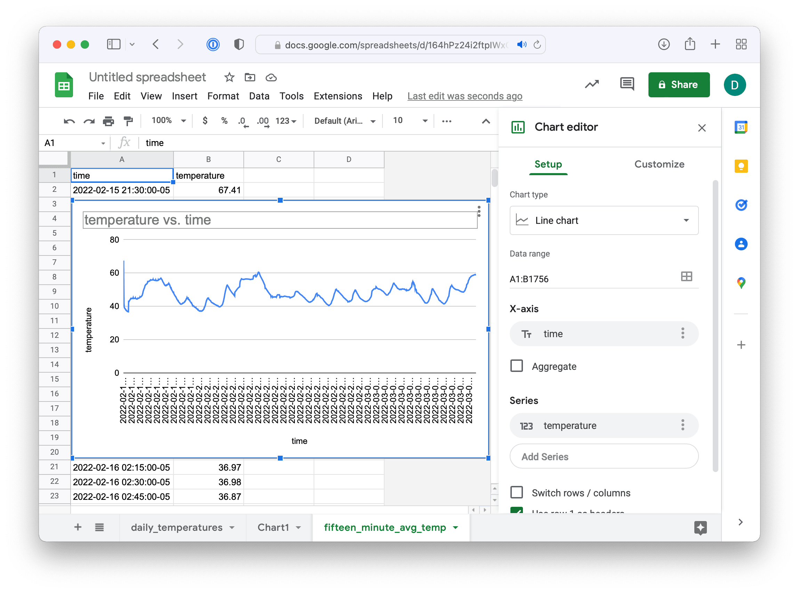
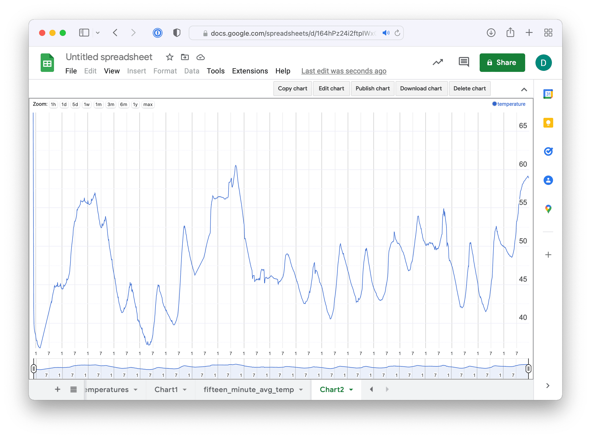

# Google Sheets 

Use Google spreadsheets to graph data.

### TimescaleDB

Connect to TimescaleDB

    psql -h timescale.dev2db.com -U your-user-name tsitp
    
Set the timezone

    SET timezone TO 'America/New_York';

### Daily Min, Max, and Average Temperatures

Run a query and export min, max, and average daily temperature for device_dc as a CSV file. The `\copy` command can't handle muli-line queries, so for readability, we create a temporary view, then export the view to CSV.

    CREATE TEMPORARY VIEW daily_temperatures AS
    SELECT time_bucket('1 day', recorded_at::timestamp)::date AS date, 
        min(reading) AS min_temp, max(reading) AS max_temp, round(avg(reading)) AS avg_temp 
        FROM sensor_data 
        WHERE measurement = 'temperature' 
        AND device = 'device_XX'
        GROUP BY date 
        ORDER BY date;

Export the data from the view to a CSV file

    \COPY (select * from daily_temperatures) to '/tmp/daily_temperatures.csv' WITH (format csv, header)

Create a new Google spreadsheet https://sheets.new

Import data using `File -> Import -> Upload`

Insert a chart using `Insert -> Chart`

Move the chart to it's own page. Click top right corner of chart. On the menu choose "Move to own sheet".

## Average Temperature using 15 Minute Buckets

Run a 2nd query, exporting average temperature using 15 minute time buckets.

    CREATE TEMPORARY VIEW fifteen_minute AS
    SELECT time_bucket('15 minutes', recorded_at::timestamp) AS time, round(avg(reading)::numeric, 2) as temperature 
        FROM sensor_data 
        WHERE measurement = 'temperature' 
        AND device = 'device_XX' 
        GROUP BY time 
        ORDER BY time;

    \COPY (SELECT * FROM fifteen_minute) to '/tmp/fifteen_minute_avg_temp.csv' WITH (format csv, header true)

Import data using `File -> Import -> Upload`. Be sure to select "Insert new sheet(s)".

Insert a chart using `Insert -> Chart`

Change the Chart Type to Timeline chart (near bottom)

Move the chart to a new sheet

