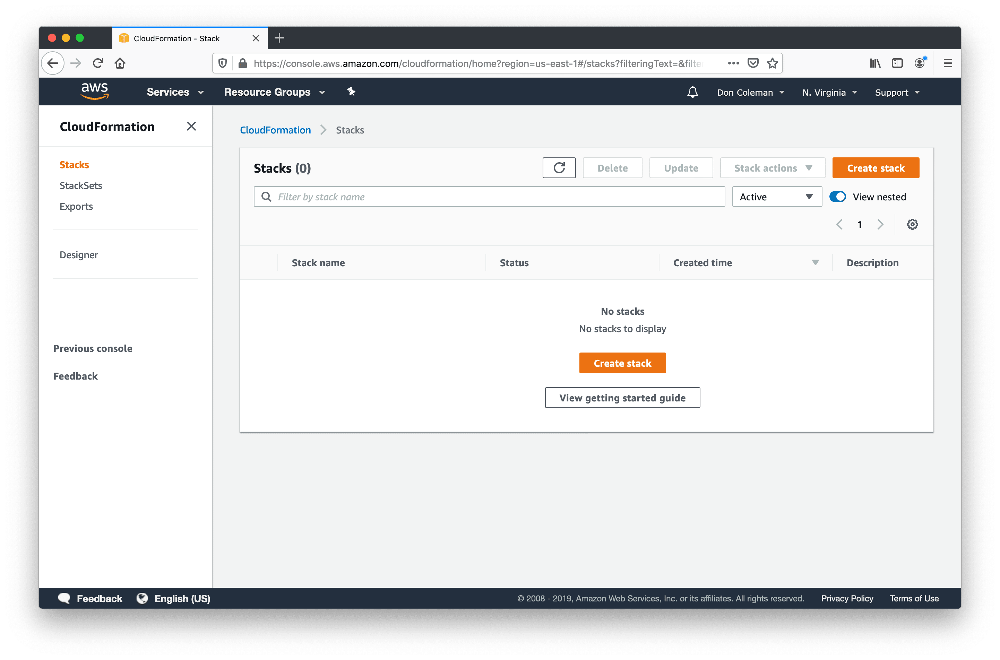
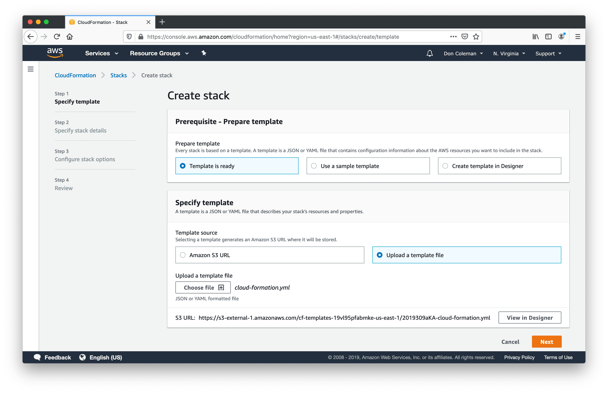
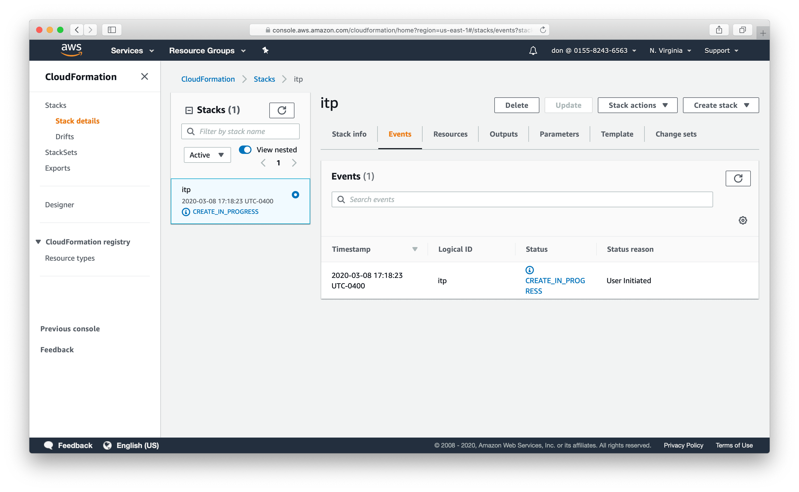
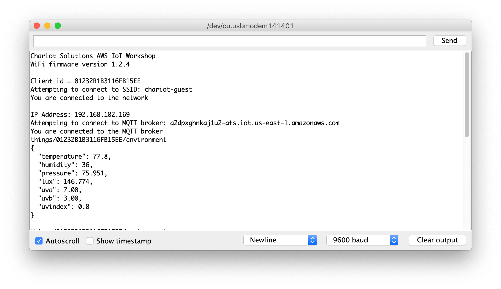
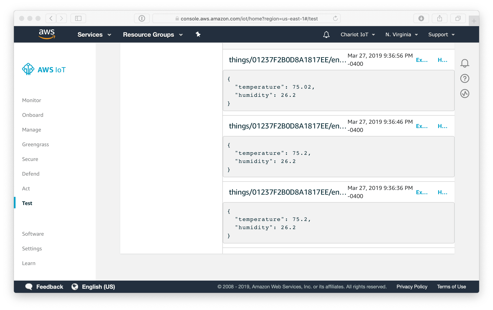

# AWS IoT

We will be using AWS to collect and store data from the Arduino. Temporary AWS accounts will be provided. You can use your own AWS account if you prefer. Some of the services will incur usage charges.

## Login

Log into the AWS Management Console using the link and credentials that were provided for you.

Choose the US East (N. Virginia) region using the dropdown on the top right of the screen.

## Cloud Formation

We are going to use an AWS Cloud Formation stack to pre-create some infrastructure for us.

From the top left of the screen, click the services menu and type `CloudFormation` into the search box.

In the CloudFormation console, press the orange `Create Stack` button on the right hand side. 

Under `Specify Template` choose `Upload a template file` as the template source. Choose `cloud-formation.yml` from the code you downloaded in <<chapter-setup>>. 

 * Press the `Next button`.
 * Enter `itp` as the stack name and click `next`.
 * Skip the configure stack options, just click `next`. 
 * On the review page,make sure you check the `I acknowledge ...` box at the bottom of the page and click `Create Stack` button. 

Once the template finishes running you will have a bunch of new AWS resources that we will use during class.

 * Core IoT Policies
 * DynamoDB Table
 * PostgreSQL Database
 * Lambda Functions
 * IAM Roles and Policies

## Arduino

In order to connect the Arduino to AWS IoT Core, our device needs to authenticate using a private key and client certificate instead of a username and password. Use the CreateCSR.ino sketch to generate a new private key and certificate signing request (CSR) on the device. The CSR is used to generate a certificate from AWS. Finally we'll use the key and certificate to connect and send data to AWS IoT.

### Create Private Key and CSR

Load the [GenerateCSR.ino](https://github.com/don/ITP-DeviceToDatabase/blob/master/02_Arduino_MQTT/arduino/GenerateCSR/GenerateCSR.ino) sketch on your Arduino Nano 33 IoT (or MRK WiFi 1010).

Open the Serial Monitor and generate a CSR. Press the "Send" button or enter key to accept all the default values. The device name is pre-populated with the serial number from the ECCX08 chip. Refer to the [week 3 instructions](https://github.com/don/ITP-DeviceToDatabase/blob/master/02_Arduino/exercises/exercise7.md) if you need more details.

Copy the CSR from the serial monitor and save to a new text file named `csr.txt`. Leave the serial monitor open, since you'll need the device serial number in the next step.

## Create Thing

Before we can connect the Arduino to AWS, we need to tell AWS about the device and generate a certificate. Log into the AWS Management console. Choose `IoT Core` from the Service Menu. In the AWS IoT console, choose `Manage -> Things` from the menu on the left.

https://console.aws.amazon.com/iot/home?region=us-east-1#/thinghub

Press the `Create` button.
Choose `Create a Single Thing`.

 * Use the **Serial Number** for your device name. Scroll down and choose Next.
 * Choose `Create with CSR`
 * Choose `csr.txt` in the Finder window
 * Choose `Upload File`
 * Check the box next to `ThingPolicy` to attach the policy your device
 * Press the `Register Thing` button

### Download the Certificate

From the [Manage -> Things](https://console.aws.amazon.com/iot/home?region=us-east-1#/thinghub) screen:
 * Click on the newly created device.
 * Click the Security menu on the left
 * Click the box with the Certificate number to show the details
 * Use the Action menu to Download the certificate
 * You will need to paste this certificate into config.h of the AWS.ino Arduino code

## Policy

AWS uses IoT policies to give things permission to access AWS IoT resources. Policies can be created using the AWS IoT website, but it's rather cumbersome. The CloudFormation template we ran before create a policy for us.

Open the [AWS IoT Core Policy screen](https://console.aws.amazon.com/iot/home?region=us-east-1#/policyhub) in your web browser. You should see the ThingPolicy that was created by AWS Cloud Formation.

This new policy ensures that when a device connects, the client id of the device matches the Common Name in the certificate. The policy also restricts the topics that a device can use. The device can only publish or subscribe to the topic that begin with `things/${clientId}/`. Clicking on the policy will show you details of the policy document. Your policy should look something like this, but with different arns.

    {
        "Version": "2012-10-17",
        "Statement": [
            {
                "Effect": "Allow",
                "Action": "iot:Connect",
                "Resource": "arn:aws:iot:us-east-1:661516571298:client/${iot:Certificate.Subject.CommonName}"
            },
            {
                "Effect": "Allow",
                "Action": [
                    "iot:Publish", 
                    "iot:Receive"
                ],
                "Resource": "arn:aws:iot:us-east-1:661516571298:topic/things/${iot:ClientId}/*"
            },
            {
                "Effect": "Allow",
                "Action": "iot:Subscribe",
                "Resource": "arn:aws:iot:us-east-1:661516571298:topicfilter/things/${iot:ClientId}/*"
            }
        ]
    }

## MQTT Endpoint

AWS generates a custom host name for each Core IoT installation. Choose `Settings` from the bottom of the main AWS IoT menu to view the custom endpoint. Copy this value, you'll need it in the next step to connect your Arduino to AWS.

## Connect

The next task is to get the Arduino connected to AWS by configuring the [AWS.ino](../02_Arduino/arduino/AWS/AWS.ino) sketch and loading it onto your Arduino. The config.h file contains all the variables you need to edit. The broker URL is the custom MQTT endpoint from the Core IoT Settings page in the last step. The device certificate is the certificate file you downloaded from AWS. Make sure you use the certificate and not the CSR. The ArduinoBearSSL library uses the certificate from config.h and private key from the crypto chip to authenticate with the AWS server in place of a username and password. Review the [instructions from week 3](/02_Arduino/exercises/exercise8.md#awsino) if necessary.

 * Open `02_Arduino/arduino/AWS/AWS.ino` in the Arudino IDE.
 * Switch to the `config.h` tab
 * Update the wifi SSID and password
 * Copy the broker URL from the AWS custom endpoint settings and paste it into config.h
 * Copy contents of the downloaded certificate into config.h
 * Deploy the code the Arduino `Sketch -> Upload`

Open the Arduino Serial Monitor and verify that your device has connected to the wireless network and to AWS.

## Test

Open the AWS IoT console and click on the [Test](https://console.aws.amazon.com/iot/home?region=us-east-1#/test) menu on the left hand side. Subscribe to the wildcard topic `#` and ensure you see data arriving from your device.

AWS is now successfully receiving data from your device!

Ensure that you can send data back to the Arduino. In the test tab, click `Publish to a topic`. The topic should be `things/${clientId}/led`. The payload should be a value between 0 and 100. Sending different values should adjust the brightness of the LED on your Arduino.

Next [Rules](rules.asciidoc) 

