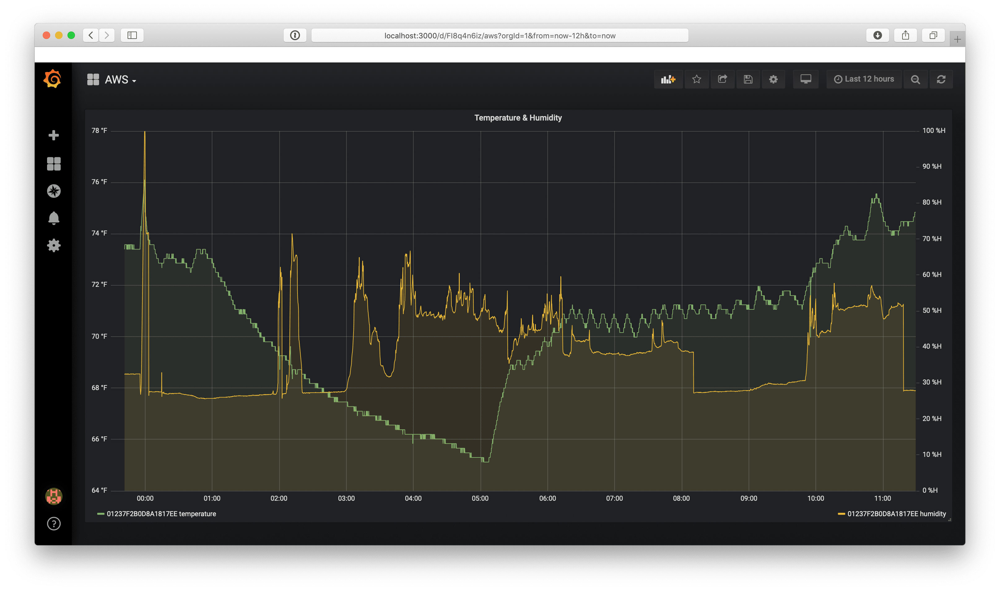

## Grafana

Use Grafana to visualize your sensor data. Log into your local Grafana server or https://grafana.dev2db.com. Add a connection to your PostgreSQL RDS database and your Influx database. Create a graph to display your sensor data.

