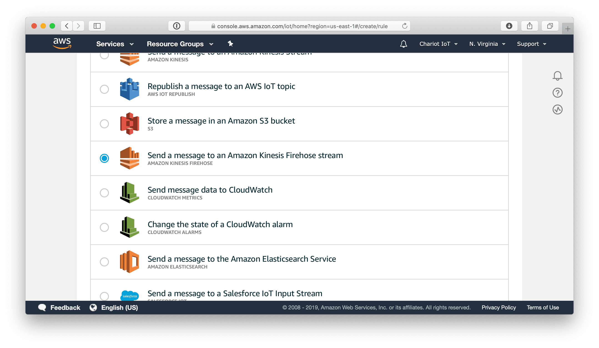
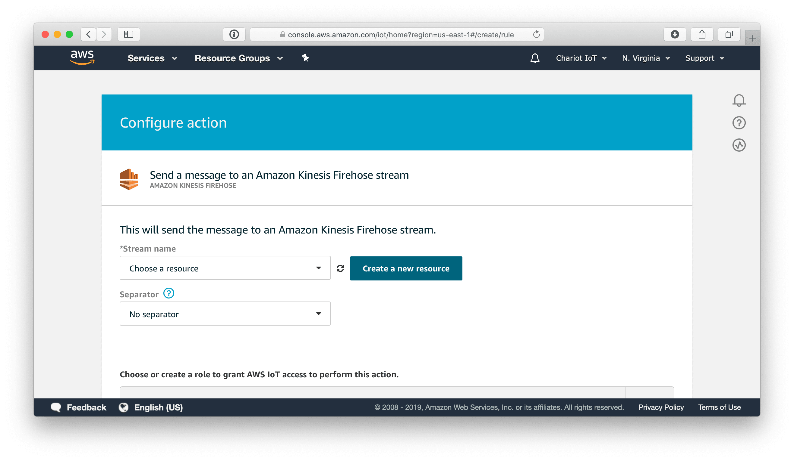
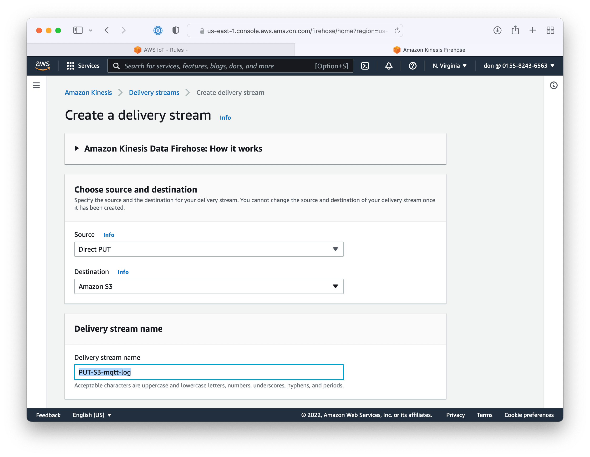
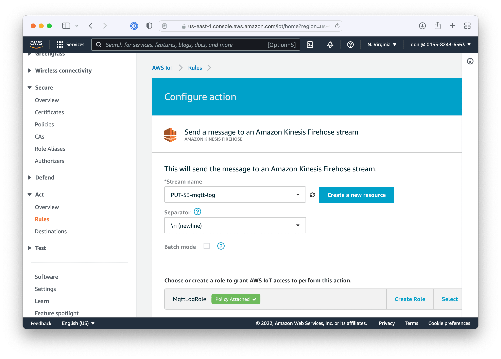
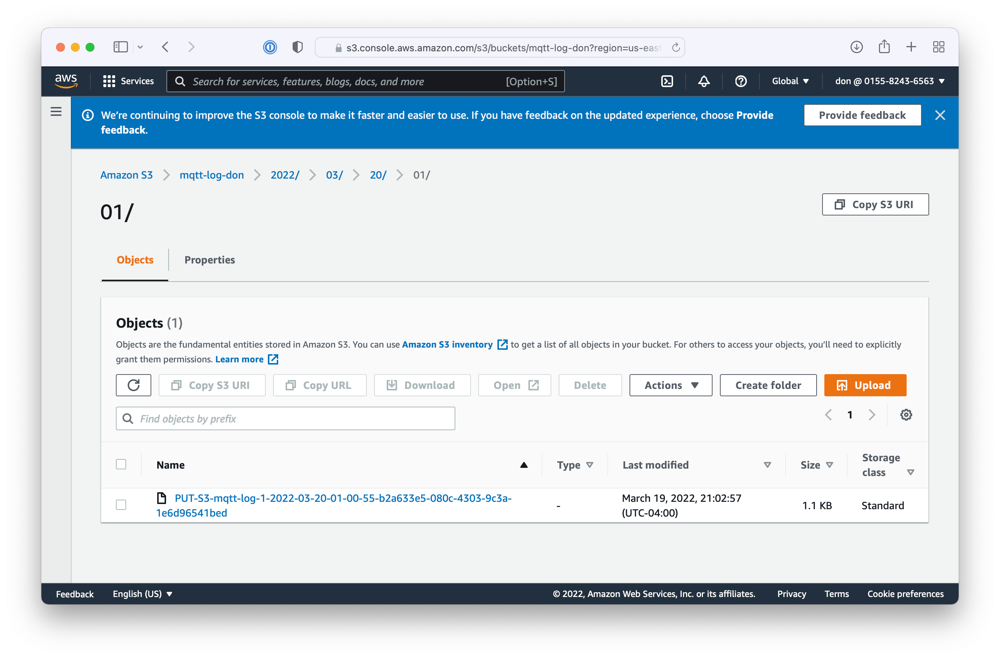

# Logging

Log all messages to S3 using Kinesis Firehose.

Create a new rule named `log`.

Set the query to be `SELECT *, clientId() as clientId, timestamp() as timestamp from '#'`

Add a Firehose action.

Create a new resource

Create a delivery stream named `mqtt-log`. NOTE: Kinesis Firehose is not in the Free Tier. You will be charged $0.029 per gigabyte.

Skip the processing of records for this tutorial. You should consider mapping JSON to Apache parquet using AWS Glue or a Lambda function for a real solution.

Set S3 as the destination.

Create a new S3 bucket. S3 bucket names must be globally unique. Suggested naming convention itp-mqtt-log-xx.

Leave the buffer size 5 minutes. Decrease the interval to 120 seconds.

Choose firehose delivery AIM role.

Create the delivery stream and then switch back to the AWS IoT rule tab. Refresh the stream names and choose the `mqtt-log` stream. Set the separator to newline.  Create a new role, MqttLogRole and press the add action button.

Press the Create rule button to finish creating the rule.

The rule has been deployed and is collecting data. Wait 120 seconds for Firehose to write a record to the S3 bucket. The log files will be prefixed by year, month, day, and hour. Download a log file to view the contents.

The log files contain rows of JSON log messages

    {"temperature":76.28,"humidity":30.3,"clientId":"01237F2B0D8A1817EE","timestamp":1553804431556}
    {"temperature":76.28,"humidity":31.9,"clientId":"01237F2B0D8A1817EE","timestamp":1553804441524}
    {"temperature":76.28,"humidity":31.8,"clientId":"01237F2B0D8A1817EE","timestamp":1553804451506}

Looking at the log file, we could probably make this better. We are missing the topic and the MQTT payload is mixed in with the metadata. Go back to the log rule and edit the query. Add the topic field and move the MQTT into a nested payload field.

    SELECT topic() as topic, clientId() as clientId, timestamp() as timestamp, * as payload from '#'

The new log messages look better
 
    {"topic":"things/01237F2B0D8A1817EE/environment","clientId":"01237F2B0D8A1817EE","timestamp":1553804960340,"payload":{"temperature":73.76,"humidity":32.3}}
    {"topic":"things/01237F2B0D8A1817EE/environment","clientId":"01237F2B0D8A1817EE","timestamp":1553804970337,"payload":{"temperature":73.76,"humidity":32.3}}
    {"topic":"things/01237F2B0D8A1817EE/environment","clientId":"01237F2B0D8A1817EE","timestamp":1553804980375,"payload":{"temperature":73.76,"humidity":32.4}}

Now that the log is working, go into Firehose job and increase the buffer interval from 120 seconds to 300 or 900 seconds.  

Next [DynamoDB](dynamo.md)