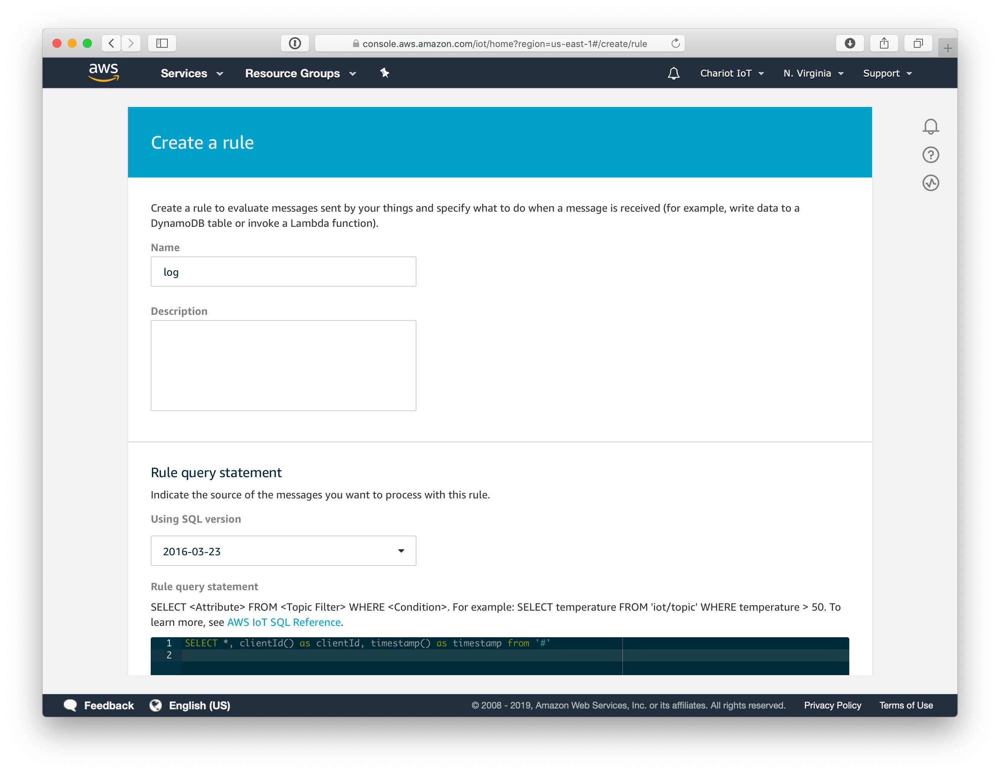
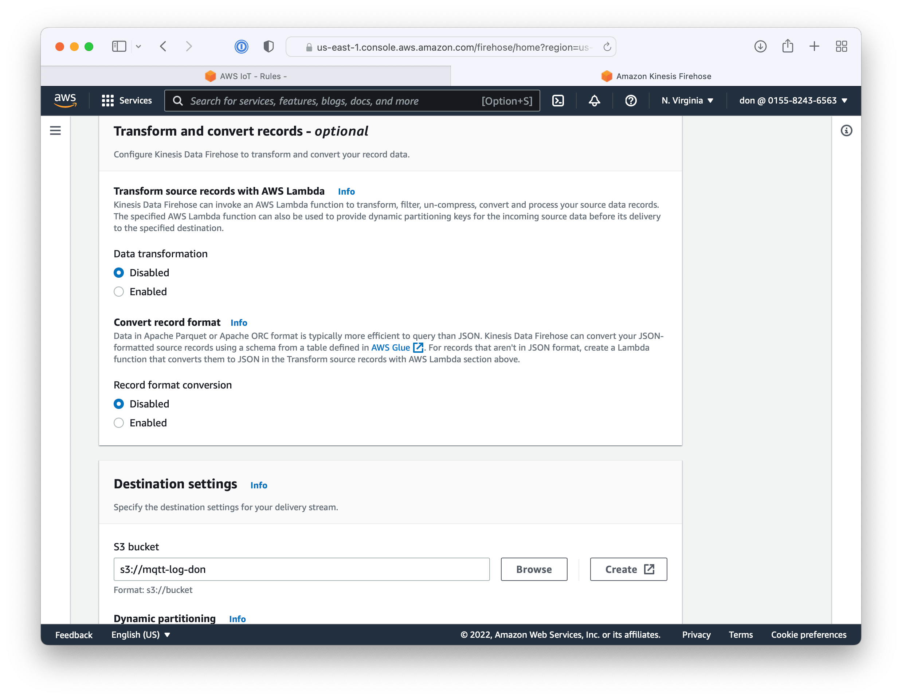

# Logging

We can log all messages to S3 using Kinesis Firehose. AWS IoT Rules have an S3 action, however that creates a new file in S3 for *every* MQTT message. Kinesis Firehose batches records together before writing to S3.

Create a new AWS IoT rule named `log`.

Set the query to be `SELECT *, clientId() as clientId, timestamp() as timestamp from '#'`

Choose the send a message to an Amazon Kinesis Firehose stream action.

Create a new resource

Create a delivery stream. NOTE: Kinesis Firehose is not in the Free Tier. You will be charged $0.029 per gigabyte.

Choose 

  * Source: Direct PUT
  * Destination: Amazon S2

Rename the stream PUT-S3-mqtt-log

Skip over the "Transform and convert records" section for this tutorial. You should consider mapping JSON to Apache parquet using AWS Glue or a Lambda function for a real project.

Press the create button to create a new S3 bucket. S3 bucket names must be globally unique. Try `itp-mqtt-log-{YOUR_NAME}`. After creating the bucket, use the browse button to choose your new bucket as the firehose destination.

Expand the 'Buffer hints, compression, and encryption' section. Leave the buffer size 5 minutes. Decrease the interval to 120 seconds so file are written every two minutes, which is better for testing.

Press the button at the bottom of the form to create the delivery stream. Switch back to the AWS IoT rule tab. Refresh the stream names and choose the `PUT-S3-mqtt-log` stream. Set the separator to newline.  Create a new role `MqttLogRole` and press the "Add action" button.

Press the "Create rule" button to finish creating the rule.

After the rule has been deployed and is collecting data we need to wait 120 seconds for Firehose to write a record to the S3 bucket. The log files will be prefixed by year, month, day, and hour. Download a log file to view the contents.

The log files contain rows of JSON log messages

    {"temperature":68.8,"humidity":57,"clientId":"0123CFBA6DEAD444EE","timestamp":1647738055494}
    {"temperature":68.9,"humidity":57,"clientId":"0123CFBA6DEAD444EE","timestamp":1647738065530}
    {"temperature":68.8,"humidity":56,"clientId":"0123CFBA6DEAD444EE","timestamp":1647738075560}

Looking at the log file, we could probably make this better. We are missing the topic and the MQTT payload is mixed in with the metadata. Go back to the log rule and edit the query. Add the topic field and move the MQTT into a nested payload field.

    SELECT topic() as topic, clientId() as clientId, timestamp() as timestamp, * as payload from '#'

The new log messages look better
 
    {"topic":"things/0123CFBA6DEAD444EE/environment","clientId":"0123CFBA6DEAD444EE","timestamp":1647738435608,"payload":{"temperature":69,"humidity":56}}
    {"topic":"things/0123CFBA6DEAD444EE/environment","clientId":"0123CFBA6DEAD444EE","timestamp":1647738445488,"payload":{"temperature":69,"humidity":56}}
    {"topic":"things/0123CFBA6DEAD444EE/environment","clientId":"0123CFBA6DEAD444EE","timestamp":1647738455503,"payload":{"temperature":69.1,"humidity":56}}

Now that the log is working, you could go back into Firehose configuration and increase the buffer interval from 120 seconds to 300 or 900 seconds so you collect more records in fewer files.

Next [Glitch](glitch.md)