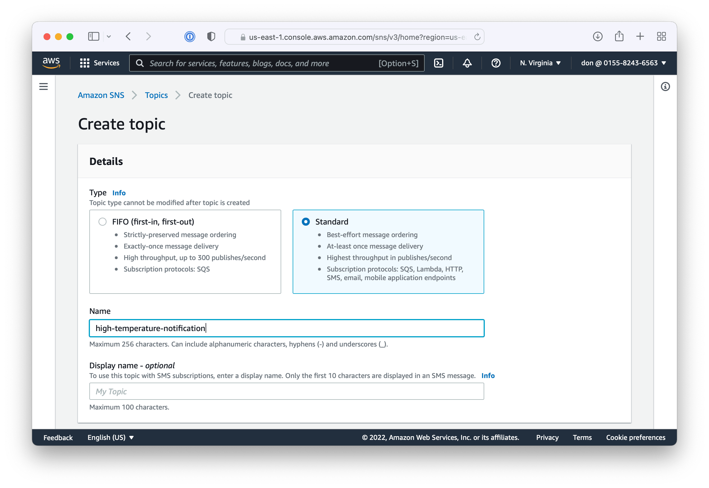
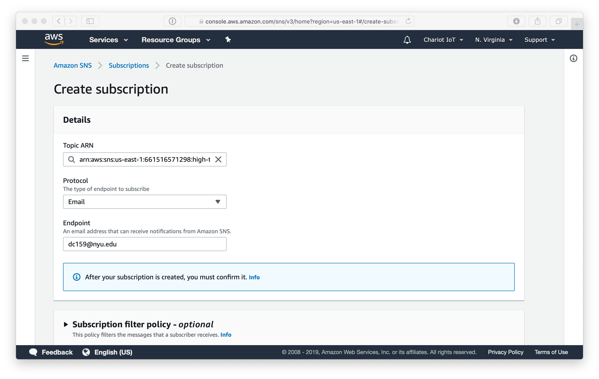
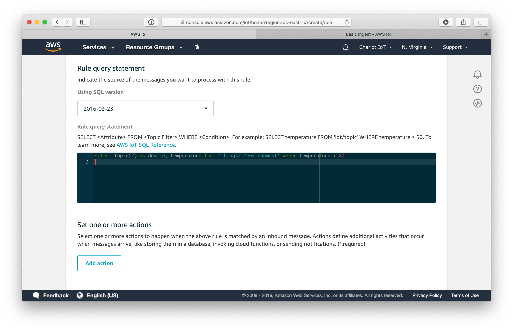
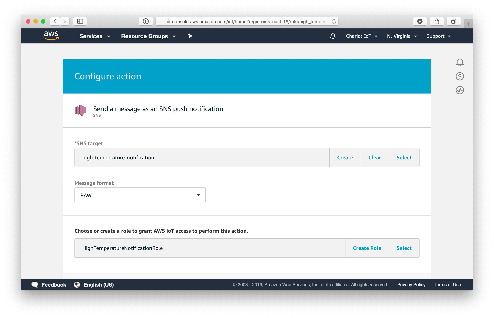

# Notifications

Create rules to notify you when the temperature exceeds a certain limit.

## SNS
Log into the AWS console and open the [Simple Notification Service (SNS) dashboard](https://console.aws.amazon.com/sns/v3/home?region=us-east-1#/dashboard).

Create a new standard topic `high-temperature-notification`.

Create a subscription. Use email for protocol and enter your email address as the endpoint.

Open your email and confirm the subscription.

## AWS IoT Rule

Go back to the AWS IoT dashboard and choose the [act tab](https://console.aws.amazon.com/iot/home?region=us-east-1#/rulehub) to create a new rule.

Name the rule `high_temperature`. Add the query for the rule

    select topic(2) as device, temperature from 'things/+/environment' where temperature > 80

Add an action that send a message using SNS push notification.

Configure the action. Select high-temperature-notification as the SNS target. The message format should be RAW. Create a new role, HighTemperatureNotificationRole.

Press the create action button then press the create rule button.

## Testing

Use the [IoT Core test page](https://console.aws.amazon.com/iot/home?region=us-east-1#/test) to send a test message with a temperature above 80°F. 

Ensure you receive an email from AWS.

For fancier notification emails, look into [AWS Simple Email Service (SES)](https://aws.amazon.com/ses/).

## SMS

AWS can send also send SMS messages for SNS topics. However, the requirements changed in 2021 and it's no longer feasable to set up a SNS subscription from the demo accounts. If you're in your own AWS account, feel free to configure SMS.

Next [Logging](logging.md)
