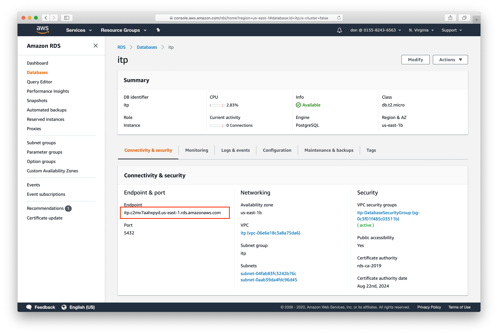
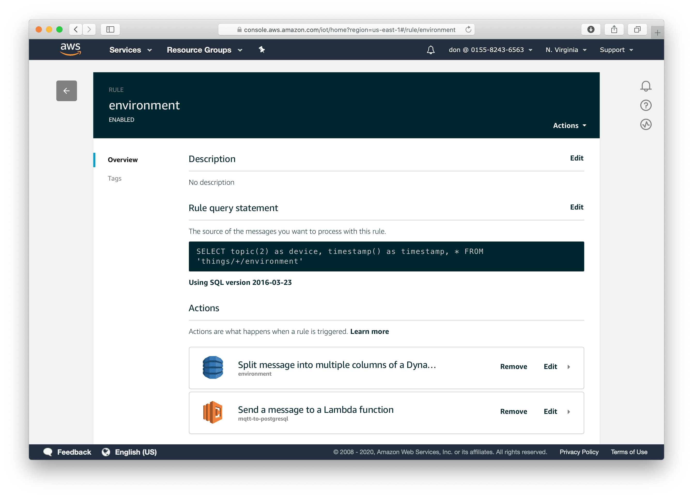
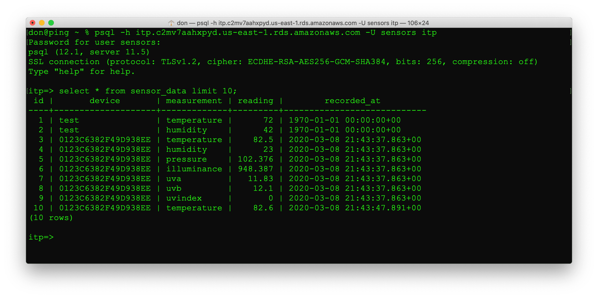

# PostgreSQL

We'd like to store the sensor data in PostgreSQL. The CloudFormation template created a PostgreSQL database using Amazon Relational Database Service (RDS). 

 * Open the RDS dashboard. Choose `Services -> RDS`.
 * Choose Databases from the left side
 * Click on the `itp` instance to see the details
 * Get the database endpoint

## Create users and schema

Connect to your database as the `postgres` user using `psql`. (We set the password for the postgres user in the CloudFormation template.)

    psql -h itp.c2mv7aahxpyd.us-east-1.rds.amazonaws.com -U postgres

As the postgres user, create some user accounts. The `sensors` user will own the database. The other accounts are for the lambda function and grafana.

    CREATE USER sensors WITH ENCRYPTED PASSWORD 'lemon.box';
    CREATE USER lambda WITH ENCRYPTED PASSWORD 'hydrogen-5';
    CREATE USER grafana WITH ENCRYPTED PASSWORD 'hat-trick';

Allow the sensors user to create new databases

    ALTER USER sensors CREATEDB;

Disconnect from psql using `\q`

Reconnect to the database as the `sensors` user.

    psql -h itp.c2mv7aahxpyd.us-east-1.rds.amazonaws.com -U sensors postgres

Create the `itp` database and connect to it

    CREATE DATABASE itp;
    \c itp

Create the tables

    -- our standard table for sensor data
    CREATE TABLE sensor_data (
        id SERIAL PRIMARY KEY,
        device VARCHAR(50),
        measurement VARCHAR(50),
        reading DOUBLE PRECISION,
        recorded_at TIMESTAMPTZ NOT NULL DEFAULT CURRENT_TIMESTAMP
    );

    -- alternate table structure where each measurement in its own column
    CREATE TABLE environment (
        id SERIAL PRIMARY KEY,
        device VARCHAR(50),
        temperature DOUBLE PRECISION,
        humidity DOUBLE PRECISION,
        pressure DOUBLE PRECISION,
        illuminance DOUBLE PRECISION,
        uva DOUBLE PRECISION,
        uvb DOUBLE PRECISION,
        uvindex DOUBLE PRECISION,
        recorded_at TIMESTAMPTZ NOT NULL DEFAULT CURRENT_TIMESTAMP
    );

Grant the lambda user permission to connect and write to the tables

    GRANT CONNECT ON DATABASE itp TO lambda;
    GRANT USAGE ON ALL SEQUENCES IN SCHEMA public TO lambda;
    GRANT INSERT ON ALL TABLES IN SCHEMA public TO lambda;

Grant the grafana user permission to connect and read from the tables

    GRANT CONNECT ON DATABASE itp TO grafana;
    GRANT SELECT ON ALL TABLES IN SCHEMA public TO grafana;

Disconnect from psql using `\q`

## Lambda

AWS Lambda allows us to run functions without worrying about a server. 

 * Open the Lambda dashboard using `Services -> Lambda`. 
 * You should see 2 functions. 
 * Click on `mqtt-to-postgres`. 
 
 This function will receive an event from a IoT Core rule and save the data to PostgreSQL. The database connection details are stored as environment variables. 
 
 * Scroll down to the environment variables section. 
 * CloudFormation populated the POSTGRESQL_HOSTNAME with the RDS database
 * Edit the database, username, and password if necessary.
 
 ## Testing

We can test the function to make sure it saves data to the database. From the top right, click `Select a test event` and choose `Configure test events`. Name the event `TestData`. Paste the following JSON and click Create.

    {
        "device": "test",
        "temperature": 72,
        "humidity": 42,
        "timestamp": 0
    }

Push `Test`. Ensure that the function executes without any errors.

Note that we're connecting directly to the database from the Lambda function. The newer way to do this is to use a [Database Proxy](https://aws.amazon.com/blogs/compute/using-amazon-rds-proxy-with-aws-lambda/).

## Rules

Now that the Lambda function works, we can have the IoT Core send data to the function. 

 * From the `Services` menu, choose `IoT Core`. 
 * Choose `Act -> Rules` from the menu on the left. 
 * Select the `environment` rule. 
 * Use the `Add action` button to add a new action. 
 * Choose `Send a message to a Lambda function`.
 * Press `Configure Action` at the bottom of the page.
 * Select `mqtt-to-postgresql`.
 * Press `Add action`.

Use psql to verify that data is being written to the sensor_data table.

    psql -h itp.c2mv7aahxpyd.us-east-1.rds.amazonaws.com -U sensors itp

    SELECT * FROM sensor_data LIMIT 10;

## Extra

Create another Lambda function that saves the sensor data to the `environment` table using the code below. Be sure to Python 3.7 if you want to use the PostgreSQL driver from the arn:aws:lambda:us-east-1:366425516243:layer:IotWorkshopLayer:1 lambda layer.

    import os
    import json
    import psycopg2
    from datetime import datetime

    host = os.environ["POSTGRESQL_HOSTNAME"] 
    user = os.environ["POSTGRESQL_USER"]
    password = os.environ["POSTGRESQL_PASSWORD"]
    db =  os.environ["POSTGRESQL_DATABASE"]
    conn = psycopg2.connect(host=host, database=db, user=user, password=password)

    sql = """
        INSERT INTO environment (
            device, temperature, humidity, pressure,
            illuminance, uva, uvb, uvindex, recorded_at
        ) 
        VALUES (%s,%s,%s,%s,%s,%s,%s,%s,%s)
    """

    def save_to_postgres(data):

        timestamp = datetime.fromtimestamp(data['timestamp'] / 1000.0)

        params = [
            data['device'],
            data['temperature'],
            data['humidity'],
            data.get('pressure'),
            data.get('illuminance'),
            data.get('uva'),
            data.get('uvb'),
            data.get('uvindex'),
            timestamp
        ]
        
        print(sql, params)

        c = conn.cursor()
        c.execute(sql, params)
        conn.commit()
        c.close()

    def lambda_handler(event, context):
        print(event) # log the event
        save_to_postgres(event)

 Next [InfluxDB](influxdb.md) 
   