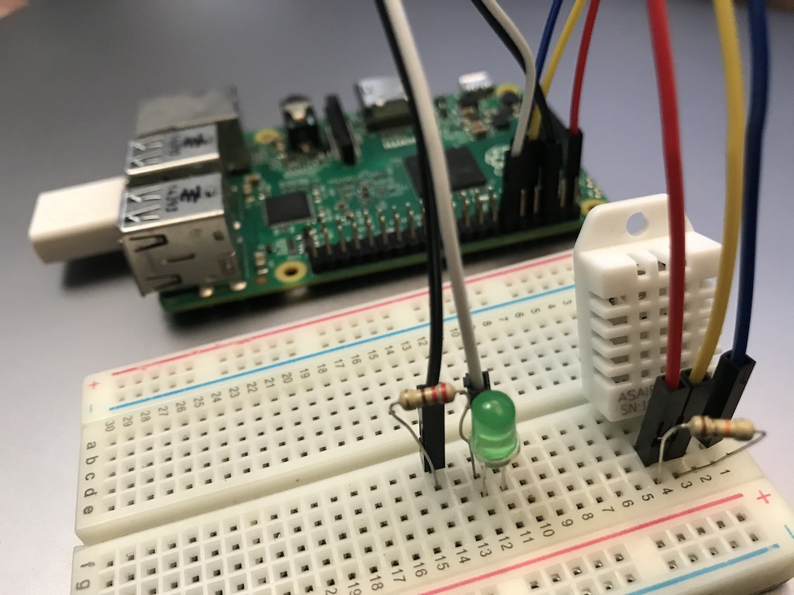
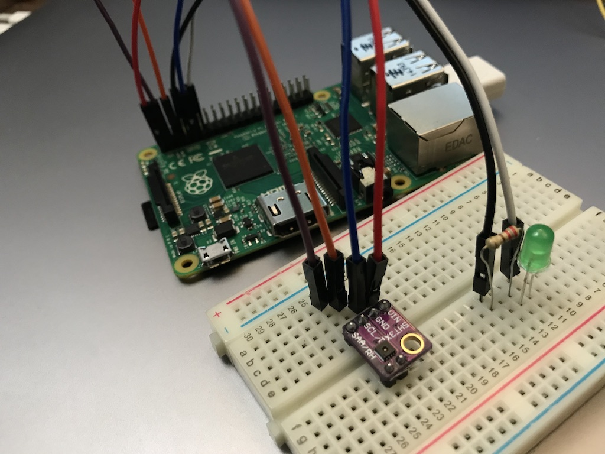

# Raspberry Pi MQTT Examples

Publish temperature and humidity data from DHT22 or SHT31 to MQTT. Subscribe to led topic to allow remote control of the LED. 

 * Temperature is published to itp/{device_id}/temperature
 * Humidity is published to itp/{device_id}/humidity
 * The device subscribes to itp/{device_id}/led and will turn the LED on or off when it receives the payload "on" or "off".

These instructions assume you are running Raspberry Pi OS buster. `cat /etc/os-release` and make sure it says VERSION_ID="10". This was tested on a Raspberry Pi 2 with the [Raspberry Pi USB WiFi Dongle](https://www.raspberrypi.org/products/raspberry-pi-usb-wifi-dongle/). I created a fresh Raspberry Pi OS image of Raspberry Pi OS Lite using the [Raspberry Pi Imager tool](https://www.raspberrypi.org/software/). After booting with the new image, I used `sudo raspi-config` to: set up the wifi, change the password, change the keyboard from UK to US, enable ssh. Then I updated to the latest os with `sudo apt update` and `sudo apt -y dist-upgrade`. Reboot the Raspberry Pi and you're ready to go.

## Setup

Use the command line to enable i2c and spi

    sudo raspi-config nonint do_i2c 0  
    sudo raspi-config nonint do_spi 0  

Install some additional packages

    sudo apt install -y python-smbus i2c-tools libgpiod2 python3-pip

## Hardware

Wire the hardware. 

For the DHT22, run 3.3v and ground to DHT22. Add a 10kΩ resistor between 3.3v and the DHT22 output pin. Connect pin 4 on the Raspberry Pi to the DHT22 ouput.

For the SHT31, run 3.3v, ground to the sensor. Connect SDA and SLC to the Raspberry Pi.

For the LED, connect pin 18 to the positive lead (anode) of the LED. Connect a 220Ω or 330Ω ohm resistor to the negative lead (cathode) of the LED. Connect the resistor to a ground pin on the Raspberry Pi.

## Code

Copy the files from your computer to the Raspberry Pi. I used ssh.

    cd ITP-DeviceToDatabase/extra
    scp -r rpi-mqtt pi@raspberrypi:

Alternately you could use a thumb drive to move the files over, or download the files from github directly to your Raspberry Pi.

### Libraries

Install the python libraries

    cd ~/rpi-mqtt
    pip3 install -r requirements.txt

### Test

Run the tests to check the hardware is working 

    python3 led_test.py
    python3 dht_test.py

### Config 
Edit config.py and enter the device_id and mqtt_password for your device.

### Run 

Run the program

    python3 dht_mqtt.py

Use MQTT Explorer to verify the broker is recieving the data.

### Daemon (Optional)

If you want the program to run as a background process or deamon, you can use [pm2](https://pm2.keymetrics.io/)

Install PM2

    sudo apt install -y nodejs npm
    sudo npm install -g pm2
    sudo pm2 setup

Start the process

    cd ~/rpi-mqtt
    pm2 start dht_mqtt.py 

Save the pm2 settings, to the process will restart on reboot

    pm2 save
